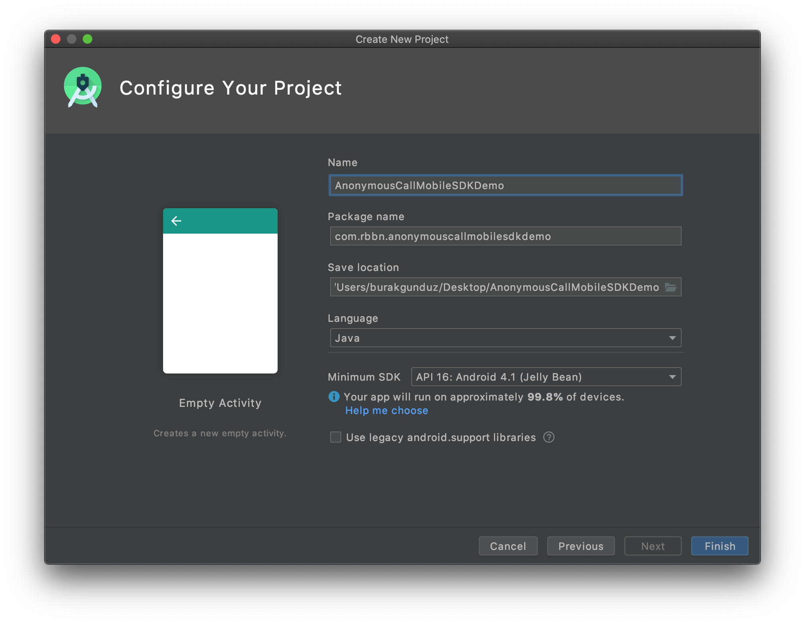
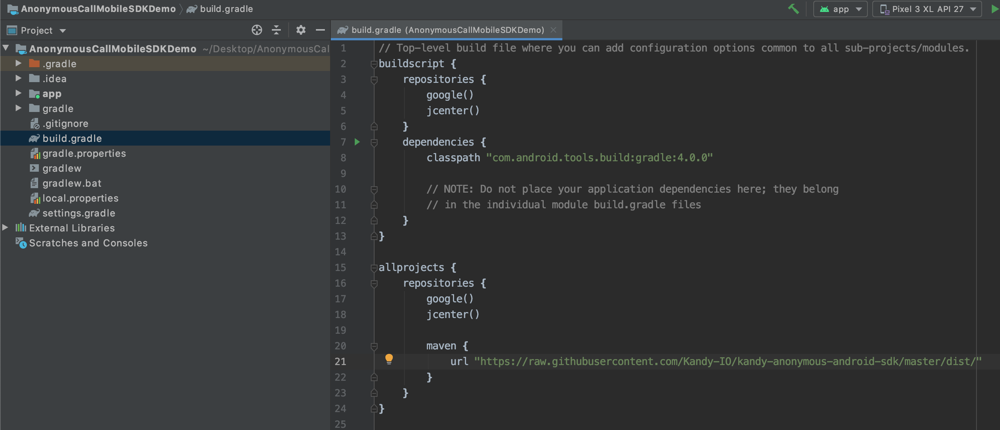
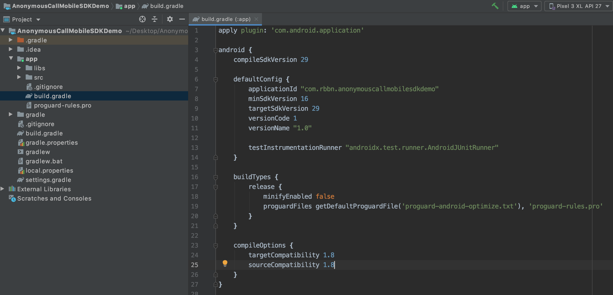
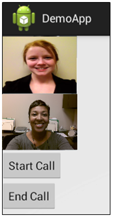

# Anonymous Call Mobile SDK User Guide for Android
Version Number: **$SDK_VERSION$**
<br>
Revision Date: **August 2, 2022**

## Anonymous Call Mobile SDK overview

The SPiDR/Kandy Link Anonymous Call Mobile Software Development Kit (SDK) defines a library implementation supporting SPiDR/Kandy Link platform features like anonymous call management (allowing unregistered users to place voice or video calls) and WebRTC on Android. You can use this library implementation to integrate SPiDR/Kandy Link services and WebRTC into your native mobile applications to create new, innovative user experiences.

The Anonymous Call Mobile SDK has the following characteristics:

* Supports REST over HTTP/HTTPS for integration with the presentation layer of SPiDR/Kandy Link
* Supports WebSocket for notification
* Access to REST APIs provided by Ribbon's Kandy platform

See [Appendix A: High-level Anonymous Call Mobile SDK structure](#appendix-a-high-level-anonymous-call-mobile-sdk-structure) for a high-level view of the Anonymous Call Mobile SDK and its sub-modules.

The Anonymous Call Mobile SDK for Android is compatible with Android 4.1.x-9.x and has been tested on the Nexus 7, Nexus 5, Samsung Note 3, Samsung Note 5, Samsung S7, HTC Desire 626, HTC One A9, HTC 10, LG G2, LG G3, LG G5, LG G6, SONY XPERIA Z5, SONY XPERIA XZ, General Mobile GM 5+.

### What's in this document?

This document provides help getting started developing your mobile application using the Anonymous Call Mobile SDK for Android. This guide contains:

* Steps to create your Android project using the Anonymous Call Mobile SDK
* Sample code to illustrate common tasks

### Before you start developing your application

The following items need to be complete prior to beginning work on your application:

* Your Android Studio development environment is set up and ready for new projects.
* You are familiar with Android development fundamentals.
* You know the IP address and port of the SPiDR/Kandy Link server.

<div class="page-break"></div>

## Get Started

This section provides an example of creating your Android project and using the Anonymous Call Mobile SDK in your project. Android Studio 3.4.2 is used for this example, but you may use your development environment of choice to create your project.

### Create your Android project

The following procedure uses Android Studio IDE to create a simple application which can use Anonymous Call MobileSDK.

1. Open the development environment (in this example, Android Studio).

2. Click **Start a new Android Studio project**.


3. Select an activity or leave as default (Empty Activity) and click **Next**.


4. Fill in the configurations for your project.

 * Type your project's **Name**, **Package name** and **Save location**. Select the **Language** you prefer your project.

 * Select minimum Android SDK version for phone and tablet (API Level 16 is recommended).

    Note that this is the minimum Android SDK API version that the demo application supports.

    For the target SDK version, Please check Google suggestion from the [link](https://developer.android.com/distribute/best-practices/develop/target-sdk). Target SDK can be changed on **build.gradle** file after the project creation.



### Adding Anonymous Call Mobile SDK dependency to your project

There are 2 options to add Anonymous Call Mobile SDK dependency to your project. You can add Anonymous Call Mobile SDK dependency from github repository or you can add it to your project manually. This document will explain both options in detail.

#### Adding the dependency from GitHub repository

1. Add Anonymous Call Mobile SDK repository url to your root level **build.gradle** file.

```groovy
allprojects {
  repositories {
    google()
    jcenter()

    maven {
      url "https://raw.githubusercontent.com/Kandy-IO/kandy-anonymous-android-sdk/master/dist/"
    }
  }
}
```



2. Add dependency of Anonymous Call Mobile SDK to your app level **build.gradle** file.

```groovy
implementation 'com.kandy.mobile:kandyanonymousmobilesdk:$SDK_VERSION$ '
```


<hr/>
<h5>NOTE</h5>
Check latest version of Anonymous Call Mobile SDK from <a href="https://github.com/Kandy-IO/kandy-anonymous-android-sdk">GitHub</a>.
<hr/>

#### Adding the dependency manually

1. Download latest Anonymous Call Mobile SDK version from [GitHub](https://github.com/Kandy-IO/kandy-anonymous-android-sdk/tree/$SDK_VERSION$/dist/com/kandy/mobile/kandyanonymousmobilesdk/$SDK_VERSION$) and copy **aar** file to your project **lib** folder.


2. After that you need to inform gradle that your app will use manual aar files. To do that add **flatDir** path to your root level **build.gradle** file as in the example above.

```groovy
flatDir {
  dirs 'libs'
}
```


3. Add dependency of Anonymous Call Mobile SDK to your app level **build.gradle** file with **@aar** prefix.

```groovy
implementation 'com.kandy.mobile:kandyanonymousmobilesdk:$SDK_VERSION$@aar'
```


### Adding Java 8 support

An Android application project must be compatible with Java 8 when it is using Mobile SDK library. This necessity comes from the WebRTC library, its code is dependent on some Java 8 features. In order to set this compliance, open **build.gradle** file, located under **app** module of **AnonymousCallMobileSDKDemoApp** project. Add the configuration script below to the file.

```groovy
android{
  compileOptions {
    targetCompatibility 1.8
    sourceCompatibility 1.8
  }
}
```



### Use the Anonymous Call Mobile SDK in your Android project

Once the library is attached to the Android project, the Anonymous Call Mobile SDK can be used by defining the necessary import items.

The following is an example using the Anonymous Call Mobile SDK in Android:

1. Locate and open **AndroidManifest.xml**.


2. Add the following permissions to the manifest file like that sample:
**Warning:** It is application developer's responsibility to make sure the related permission is granted before it is used in order to prevent possible crashes. Namely, if developer wants to establish an audio call,she or he is supposed to check "android.permission.RECORD_AUDIO" permission is granted. If not they should not let call establish.

```xml
<manifest xlmns:android...>
    ...
    <uses-feature android:glEsVersion="0x00020000" android:required="true" />
    <uses-feature android:name="android.hardware.camera" />
    <uses-feature android:name="android.hardware.camera.autofocus" />

    <uses-permission android:name="android.permission.INTERNET" />
    <uses-permission android:name="android.permission.ACCESS_NETWORK_STATE" />
    <uses-permission android:name="android.permission.MODIFY_AUDIO_SETTINGS" />
    <uses-permission android:name="android.permission.RECORD_AUDIO" />
    <uses-permission android:name="android.permission.CAMERA" />
    <application ...>
        ...
    </application>
</manifest>
```

3. In your project folder, navigate to **res** > **layout** and open **activity_main.xml** to create your UI.


4. You can create your UI in a graphical mode (if available) or in xml editor mode. In this example, editing will be done in the xml view.

5. Choose a layout for your UI. In Android, developers can use a variety of layouts for UI. In this example, we will use LinearLayout (Vertical) for the UI and set the orientation vertical. The example layout below also contains two buttons and two video views in the LinearLayout.

```xml
<?xml version="1.0" encoding="utf-8"?>
<LinearLayout xmlns:android="http://schemas.android.com/apk/res/android"
              android:layout_width="match_parent"
              android:layout_height="match_parent"
              android:orientation="vertical">

    <com.genband.mobile.core.webrtc.view.VideoView
        android:id="@+id/remoteVideoView"
        android:layout_width="120dp"
        android:layout_height="90dp"
        />

    <com.genband.mobile.core.webrtc.view.VideoView
        android:id="@+id/localVideoView"
        android:layout_width="120dp"
        android:layout_height="90dp"
        />

    <Button
        android:id="@+id/startVideoButton"
        android:layout_width="wrap_content"
        android:layout_height="wrap_content"
        android:text="Start Call"
        />

    <Button
        android:id="@+id/stopVideoButton"
        android:layout_width="wrap_content"
        android:layout_height="wrap_content"
        android:text="End Call"
        />
</LinearLayout>
```


6. Open the `MainActivity`. If project has no activity, create one.

<!-- tabs:start -->

#### ** Java Code **

```java
public class MainActivity extends Activity {

    @Override
    protected void onCreate(Bundle savedInstanceState) {
        super.onCreate(savedInstanceState);
        setContentView(R.layout.activity_main);
    }
}
```

#### ** Kotlin Code **

```kotlin
class MainActivity : AppCompatActivity() {
    override fun onCreate(savedInstanceState: Bundle?) {
        super.onCreate(savedInstanceState)
        setContentView(R.layout.activity_main)
    }
}
```
<!-- tabs:end -->

7. Define the configuration attributes.

<!-- tabs:start -->

#### ** Java Code **

```java
public void configExample() {
    Configuration configuration = Configuration.getInstance();

    configuration.setRestServerIp("$SUBSCRIPTIONFQDN$");
    configuration.setRestServerPort(443);

    ICEServers iceServers = new ICEServers();
    iceServers.addICEServer("$TURNSERVER1$");
    iceServers.addICEServer("$TURNSERVER2$");
    iceServers.addICEServer("$STUNSERVER1$");
    iceServers.addICEServer("$STUNSERVER2$");
    configuration.setICEServers(iceServers);

    configuration.setWebSocketServerIp("$WEBSOCKETFQDN$");
    configuration.setWebSocketServerPort(443);
}
```

#### ** Kotlin Code **

```kotlin
fun configExample(){
        val configuration = Configuration.getInstance()
        configuration.restServerIp = "SUBSCRIPTIONFQDN$"
        configuration.restServerPort = 443

        val iceServers = ICEServers()
        iceServers.addICEServer("$TURNSERVER1$")
        iceServers.addICEServer("$TURNSERVER2$")
        iceServers.addICEServer("STUNSERVER1$")
        iceServers.addICEServer("STUNSERVER2$")
        configuration.iceServers = iceServers

        configuration.webSocketServerIp = "$WEBSOCKETFQDN$"
        configuration.webSocketServerPort = 443
    }
```
<!-- tabs:end -->

8. Define a global variable `call`.

<!-- tabs:start -->

#### ** Java Code **

```java
CallInterface call;
```

#### ** Kotlin Code **

```kotlin
var call:CallInterface? = null
```
<!-- tabs:end -->

9. The Call service uses callbacks to publish response events. To receive callbacks, a class must implement the necessary interface.

	Modify the activity class to implement the interface.

<!-- tabs:start -->

#### ** Java Code **

```java
public class MainActivity extends Activity
        implements CallApplicationListener {

.
.
.

}
```

#### ** Kotlin Code **

```kotlin
class MainActivity : AppCompatActivity(), CallApplicationListener {

.
.
.

}    
```
<!-- tabs:end -->

10. Define `startCall()` method which will create an outgoing call instance and establish an anonymous call with it.

<!-- tabs:start -->

#### ** Java Code **

```java
public void startCall() {
    AnonymousServiceProvider serviceProvider = AnonymousServiceProvider.getInstance(getApplicationContext());
    CallServiceInterface callService = serviceProvider.getCallService();
    try {
        callService.setCallApplication(MainActivity.this);
    } catch (MobileException exception) {
    }
    callService.createOutgoingCall("AnonymousCaller", " alice@rbbn.com ",
            new OutgoingCallCreateInterface() {
                @Override
                public void callCreated(OutgoingCallInterface callInterface) {
                    call = callInterface;
                    callInterface.setLocalVideoView((VideoView)
                            findViewById(R.id.localVideoView));
                    callInterface.setRemoteVideoView((VideoView)
                            findViewById(R.id.remoteVideoView));
                    callInterface.establishCall(true);
                }

                @Override
                public void callCreationFailed(MobileError error) {
                }
            });
}
```
#### ** Kotlin Code **

```kotlin
fun startCall(){
        val serviceProvider = AnonymousServiceProvider.getInstance(applicationContext)
        val callService = serviceProvider.callService
        try {
            callService.setCallApplication(this@MainActivity)
        } catch (exception:MobileException){
        }
        callService.createOutgoingCall("AnonymousCaller", "alice@rbbn.com", object:OutgoingCallCreateInterface{
            override fun callCreated(callInterface: OutgoingCallInterface?) {
                call = callInterface
                callInterface?.setLocalVideoView(findViewById(R.id.localVideoView))
                callInterface?.setRemoteVideoView(findViewById(R.id.remoteVideoView))
                callInterface?.establishCall(true)
            }

            override fun callCreationFailed(error: MobileError?) {
            }
        })
    }
```    
<!-- tabs:end -->

11. Bind the `startCall()` method with the start video button.

<!-- tabs:start -->

#### ** Java Code **

```java
Button startCall = (Button) findViewById(R.id.startVideoButton);
startCall.setOnClickListener(new View.OnClickListener() {
    @Override
    public void onClick(View v) {
        register();
    }
});
```

#### ** Kotlin Code **

```kotlin
val startCall = findViewById<Button>(R.id.startVideoButton)
        startCall.setOnClickListener { 
            register()
        }
        
        // OR 
        
        startVideoButton.setOnClickListener {
            register()
        }
```
<!-- tabs:end -->

12. Define `stopCall()` method.

<!-- tabs:start -->

#### ** Java Code **

```java
public void stopCall() throws MobileException {
    if(call != null) {
        call.endCall();
    }
}
```

#### ** Kotlin Code **

```kotlin
@Throws(MobileException::class)
    fun stopCall(){
        call?.endCall()
    }
```
<!-- tabs:end -->

13. Bind the `stopCall()` method with the stop video button.

<!-- tabs:start -->

#### ** Java Code **

```java
Button stopCall = (Button) findViewById(R.id.stopVideoButton);
stopCall.setOnClickListener(new View.OnClickListener() {
    @Override
    public void onClick(View v) {
        try {
            stopCall();
        }
        catch (MobileException exception) {
        }
    }
});
```

#### ** Kotlin Code **

```kotlin
val stopCall = findViewById<Button>(R.id.stopVideoButton)
        stopCall.setOnClickListener {
            try{
                stopCall()
            } catch (exception:MobileException){
            }
        }
```
<!-- tabs:end -->

14. Run the demo application.



### Enable background processing

The application must support background processing while on an active call, allowing SDK to process WebSocket operations even after the user presses the Home button, the Sleep/Wake button, or if another application is launched. Implement triggers for related activities (e.g. video call) to respond to Android's activity life-cycle events (e.g. pause/resume).

###### Example: Implement triggers for background processing

<!-- tabs:start -->

#### ** Java Code **

```java
@Override
protected void onPause()
{
    super.onPause();
    SDKEventManager.handleEvent(SDKEvents.EVENT_BACKGROUND);
}

@Override
protected void onResume()
{
    super.onResume();
    SDKEventManager.handleEvent(SDKEvents.EVENT_FOREGROUND);
}
```

#### ** Kotlin Code **

```kotlin
override fun onPause() {
        super.onPause()
        SDKEventManager.handleEvent(Constants.SDKEvents.EVENT_BACKGROUND)
    }

    override fun onResume() {
        super.onResume()
        SDKEventManager.handleEvent(Constants.SDKEvents.EVENT_FOREGROUND)
    }
```
<!-- tabs:end -->

<hr/>
<h5>WARNING</h5>
Android may kill an activity under certain conditions (e.g while the application or activity is in the background).
This behavior causes VideoView objects to be disposed; Therefore, both local and remote VideoView objects must be set again when activity resumes from the background.
<br/><br/>
If there is more than one call object, video views must be set again for each of the call objects.
<hr/>

Use the onResume function to set all video views.

###### Example: Set all views

<!-- tabs:start -->

#### ** Java Code **

```java
@Override
protected void onResume()
{
    super.onResume();
    SDKEventManager.handleEvent(SDKEvents.EVENT_FOREGROUND);
    call.setLocalVideoView((VideoView)findViewById(R.id.localVideoView));
    call.setRemoteVideoView((VideoView)findViewById(R.id.remoteVideoView));
    call2.setLocalVideoView((VideoView)findViewById(R.id.localVideoView2));
    call2.setRemoteVideoView((VideoView)findViewById(R.id.remoteVideoView2));
}
```

#### ** Kotlin Code **

```kotlin
override fun onResume() {
        super.onResume()
        SDKEventManager.handleEvent(Constants.SDKEvents.EVENT_FOREGROUND)
        call?.setLocalVideoView(findViewById(R.id.localVideoView))
        call?.setRemoteVideoView(findViewById(R.id.remoteVideoView))
        call2?.setLocalVideoView(findViewById(R.id.localVideoView2))
        call2?.setRemoteVideoView(findViewById(R.id.remoteVideoView2))
    }
```
<!-- tabs:end -->

### Set application configuration

First, you must access and modify the Configuration utility to update attributes such as REST server IP or Port. The Anonymous Call Mobile SDK receives data from the Configuration utility, and the third-party mobile application (third-party app) must provide necessary data to the Configuration utility.

To see all available configurations, see [Appendix D: Detailed Configurations](#appendix-d-detailed-configurations).

###### Example: Accessing and updating Configuration

<!-- tabs:start -->

#### ** Java Code **

```java
public class Demo {
    public void configurationExample() {
        //Configuration.getInstance is used to access the static Configuration instance
        //Access Configuration values through Java Beans getter/setter approach
        Configuration configuration = Configuration.getInstance();

        //set minimum Configuration values

        //server IP value for SPiDR/Kandy Link
        configuration.setRestServerIp("$SUBSCRIPTIONFQDN$");
        //server port value for SPiDR/Kandy Link
        configuration.setRestServerPort(443);

         //IP used in websocket connection creation
        configuration.setWebSocketServerIp("$WEBSOCKETFQDN$");
        //port used in websocket connection creation
        configuration.setWebSocketServerPort(443);

        // SPiDR/Kandy Link TURN server using udp transport in WebRTC's peer connection
        ICEServers iceServers = new ICEServers();
        iceServers.addICEServer("$TURNSERVER1$");
        iceServers.addICEServer("$TURNSERVER2$");
        iceServers.addICEServer("$STUNSERVER1$");
        iceServers.addICEServer("$STUNSERVER2$");
        configuration.setICEServers(iceServers);
    }
}
```

#### ** Kotlin Code **

```kotlin
class Demo {
    fun configurationExample(){
        //Configuration.getInstance is used to access the static Configuration instance
        //Access Configuration values through Java Beans getter/setter approach
        val configuration = Configuration.getInstance()

        //set minimum Configuration values
        
        //server IP value for SPiDR
        configuration.restServerIp = "$SUBSCRIPTIONFQDN$"
        //server port value for SPiDR
        configuration.restServerPort = 443
        
        //IP used in websocket connection creation
        configuration.webSocketServerIp = "$WEBSOCKETFQDN$";
        //port used in websocket connection creation
        configuration.webSocketServerPort = 443;

        // SPiDR/Kandy Link TURN server using udp transport in WebRTC's peer connection
        val iceServers = ICEServers()
        iceServers.addICEServer("$TURNSERVER1$")
        iceServers.addICEServer("$TURNSERVER2$")
        iceServers.addICEServer("$STUNSERVER1$")
        iceServers.addICEServer("$STUNSERVER2$")
        configuration.iceServers = iceServers
        }
}
```
<!-- tabs:end -->

### Set up logging functionality

Logging provides a way to trace process execution. The Log Manager is defined to handle logging requests made by the Mobile SDK. The Log Manager does not process the logging messages, rather it receives logging message requests and delivers them to the logger defined in the Configuration utility (logger is initially "null"; you must set an object which conforms to LoggingInterface methods in the Configuration utility).

###### Example: Define logger

<!-- tabs:start -->

#### ** Java Code **

```java
public class LogUtilityExample implements LoggingInterface {

    @Override
    public void log(LogLevel loglevel, String tag, String message) {
        if(loglevel == LogLevel.ERROR) {
            Log.e(tag, message);
        } else if(loglevel == LogLevel.WARNING) {
            Log.w(tag, message);
        } else if(loglevel == LogLevel.TRACE) {
            Log.i(tag, message);
        } else {
            Log.d(tag, message);
        }
    }
}
```

#### ** Kotlin Code **

```kotlin
class LogUtilityExample : LoggingInterface {
    
    override fun log(loglevel: Constants.LogLevel?, tag: String?, message: String?) {
        if(loglevel == Constants.LogLevel.ERROR) {
            Log.e(tag, message)
        } else if(loglevel == Constants.LogLevel.WARNING) {
            Log.w(tag, message)
        } else if(loglevel == Constants.LogLevel.TRACE) {
            Log.i(tag, message)
        } else {
            Log.d(tag, message)
        }
    }
}
```
<!-- tabs:end -->

###### Example: Initialize logger

<!-- tabs:start -->

#### ** Java Code **

```java
public void initializeAndUseLogger() {
	Configuration.getInstance().setLogger(new LogUtilityExample());
	LogManager.log(LogLevel.TRACE, "Test", "logger is initialized");
}
```

#### ** Kotlin Code **

```kotlin
fun initializeAndUseLogger(){
        Configuration.getInstance().logger = LogUtilityExample()
        LogManager.log(Constants.LogLevel.TRACE,"Test","logger is initialized")
    }
```
<!-- tabs:end -->
##### Log Levels
###### Trace_WebRTC
The application developer should use this level to view all webrtc and SDK logs.
###### Trace
This is really fine-grained information. When you're at this level, you're basically looking to capture every detail you possibly can about the application's behavior. Think of this level as the method you should use for all the logging you will do while tracking a specific problem and most likely get rid of it once you find the problem.

App developer should use this level to view all messages on the sdk side. The logs coming from this level will lead to the solution of the SDK error. However, it should be noted that webrtc logs will not be displayed at this level.
###### Info
Info messages correspond to normal application behavior. They provide the skeleton of what happened. A service started or stopped. The notification engine started, you got a new message or network status changed. Think of it as all the messages you'd like to see in the log when creating call for example, or in other words - anything that might help you resolve or at least identify a problem without looking in the source code.

Logs at this level can either solve the problem or have ideas to solve the problem, but this is not guaranteed. It contains less information than the trace level.However, it should be noted that webrtc logs will not be displayed at this level.
###### Warning
Use this log level to indicate that you might have a problem and that you've detected an unusual situation. Maybe you were trying to invoke a service and it failed a couple of times before connecting on an automatic retry or you were trying to start a service which already running. It's unexpected and unusual, but no real harm done, and it's not known whether the issue will persist or recur. The application can tolerate warning messages, but they should always be justified and examined.

This level can be use to see errors and warnings from Sdk. Developer can view where the error is, but may not be able to find root cause of an error.Webrtc logs will not be displayed at this level
###### Error
An error is a serious issue and represents the failure of something important going on in your application. No system can tolerate items logged on this level. Maybe you've got something like dropped WebSocket connections or the inability to access a service.

This level can be use to see only errors from Sdk. Developer can view where the error is, but may not be able to find root cause of an error.Webrtc logs will not be displayed at this level

##### Storing logs

Our recommendation is to store the logs in memory and provide the ability to send them log file over e-mail to our support team if issues are encountered.Please check our sample below.

You can store logs like :

<!-- tabs:start -->

#### ** Java Code **

```java
public class LogHelper {
    public static File logFile;

    public static void saveLog() {
        if (isExternalStorageWritable()) {

            File appDirectory = new File(Environment.getExternalStorageDirectory() + "/KandyLinkDemoApp");
            File logDirectory = new File(appDirectory + "/log");
            LogHelper.logFile = new File(logDirectory, "KandyLinkAndroidLogs" + ".txt");

            // create app folder
            if (!appDirectory.exists()) {
                appDirectory.mkdir();
            }

            // create log folder
            if (!logDirectory.exists()) {
                logDirectory.mkdir();
            }

            try {
                Process process = Runtime.getRuntime().exec("logcat -c");
                process = Runtime.getRuntime().exec("logcat -f " + LogHelper.logFile);
            } catch (IOException e) {
                e.printStackTrace();
            }

        } else if (isExternalStorageReadable()) {
            // only readable
        } else {
            // not accessible
        }
    }

    /* Checks if external storage is available for read and write */
    public static boolean isExternalStorageWritable() {
        String state = Environment.getExternalStorageState();
        return Environment.MEDIA_MOUNTED.equals(state);
    }

    /* Checks if external storage is available to at least read */
    public static boolean isExternalStorageReadable() {
        String state = Environment.getExternalStorageState();
        return Environment.MEDIA_MOUNTED.equals(state) ||
                Environment.MEDIA_MOUNTED_READ_ONLY.equals(state);
    }
}
```

#### ** Kotlin Code **

```kotlin
object LogHelper {
    var logFile: File? = null
    
    fun saveLog() {
        when {
            isExternalStorageWritable -> {
                val appDirectory =
                    File(Environment.getExternalStorageDirectory().toString() + "/KandyLinkDemoApp")
                val logDirectory = File("$appDirectory/log")
                logFile = File(logDirectory, "KandyLinkAndroidLogs" + ".txt")

                // create app folder
                if (!appDirectory.exists()) {
                    appDirectory.mkdir()
                }

                // create log folder
                if (!logDirectory.exists()) {
                    logDirectory.mkdir()
                }
                try {
                    var process = Runtime.getRuntime().exec("logcat -c")
                    process = Runtime.getRuntime().exec("logcat -f $logFile")
                } catch (e: IOException) {
                    e.printStackTrace()
                }
            }
            isExternalStorageReadable -> {
                // only readable
            }
            else -> {
                // not accessible
            }
        }
    }

    /* Checks if external storage is available for read and write */
    private val isExternalStorageWritable: Boolean
        get() {
            val state = Environment.getExternalStorageState()
            return Environment.MEDIA_MOUNTED == state
        }

    /* Checks if external storage is available to at least read */
    private val isExternalStorageReadable: Boolean
        get() {
            val state = Environment.getExternalStorageState()
            return Environment.MEDIA_MOUNTED == state || Environment.MEDIA_MOUNTED_READ_ONLY == state
        }
}
```
<!-- tabs:end -->

<div class="page-break"></div>

## Basic Usage

### Listen Call Service notifications

To receive event notifications of call service, `CallApplicationListener` should be implemented by calling `setCallApplication`.

Anonymous calls can be manipulated with methods such as mute/unmute and start/stop video.

###### Example: Setting Call Application Listener

<!-- tabs:start -->

#### ** Java Code **

```java
public class CallActivity extends Activity implements CallApplicationListener {

  @Override
  protected void onResume() {
      super.onResume();

      AnonymousServiceProvider serviceProvider = AnonymousServiceProvider.getInstance(getApplicationContext());
      CallServiceInterface callService = serviceProvider.getCallService();
      callService.setCallApplication(CallActivity.this);
  }
}
```

#### ** Kotlin Code **

```kotlin
class CallActivity : AppCompatActivity(), RegistrationApplicationListener, CallApplicationListener {
    override fun onResume() {
        super.onResume()
            val serviceProvider = AnonymousServiceProvider.getInstance(applicationContext)
            val callService = serviceProvider.callService
            callService.setCallApplication(this@CallActivity)
    }
}
```
<!-- tabs:end -->

### Adding STUN/TURN servers

SPiDR/Kandy Link provides TURN server support for media relay between two WebRTC endpoints in core version 3.0 and later. The ICEServers property in the Configuration class is used to store the ICE servers list; more than one ICEServer can exist in this property.

#### Adding SPiDR's (Kandy Link) TURN server

After registration, the Mobile SDK gets default credentials from SPiDR/Kandy Link for the TURN servers and updates the defaultICEUsername and defaultICEPassword configuration properties. The list of ICEServers and their credentials are added to the PeerConnection when creating a call.

The following code sample will request TURN server credentials from SPiDR/Kandy Link and update the configuration instance.

**Note:** If your SPiDR/Kandy Link core version does not have TURN Server support, adding a TURN server without a username and password will cause the registration request to fail.

###### Example: Adding STUN/TURN server

<!-- tabs:start -->

#### ** Java Code **

```java
ICEServers servers = new ICEServers();
servers.addICEServer("$TURNSERVER1$");
servers.addICEServer("$STUNSERVER1$");
servers.addICEServer("$TURNSERVER2$");
servers.addICEServer("$STUNSERVER2$");

Configuration.getInstance().setICEServers(servers);
```

#### ** Kotlin Code **

```kotlin
val iceServers = ICEServers()
iceServers.addICEServer("$TURNSERVER1$")
iceServers.addICEServer("$TURNSERVER2$")
iceServers.addICEServer("$STUNSERVER1$")
iceServers.addICEServer("$STUNSERVER2$")
Configuration.getInstance().iceServers = iceServers
```
<!-- tabs:end -->

#### Adding an external TURN/STUN server

You also have the option of using external TURN/STUN servers while establishing calls rather than SPiDR's (Kandy Link) TURN server(s). The ICEServers property will store the address and username/password for the server(s).

Use the addICEServer:username:password: method of the ICEServers object to define credentials.

###### Example: Adding a STUN server

<!-- tabs:start -->

#### ** Java Code **

```java
ICEServers servers = new ICEServers();
servers.addICEServer("$STUNSERVER1$");
Configuration.getInstance().setICEServers(servers);
// or
ICEServers servers = Configuration.getInstance().getICEServers();
servers.addICEServer("$STUNSERVER1$");
```

#### ** Kotlin Code **

```kotlin
val servers = ICEServers()
servers.addICEServer("$STUNSERVER1$")
Configuration.getInstance().iceServers = servers
//or
val servers = Configuration.getInstance().iceServers
servers.addICEServer("$STUNSERVER1$")
```
<!-- tabs:end -->

###### Example: Adding a TURN server

<!-- tabs:start -->

#### ** Java Code **

```java
ICEServers servers = Configuration.getInstance().getICEServers();
servers.addICEServer("$TURNSERVER1$", "username", "password");
servers.addICEServer("$TURNSERVER2$", "username", "password");
servers.addICEServer("$TURNSERVER2$", "username", "password");
```

#### ** Kotlin Code **

```kotlin
val servers = Configuration.getInstance().iceServers
servers.addICEServer("$TURNSERVER1$", "username", "password")
servers.addICEServer("$TURNSERVER2$", "username", "password")
servers.addICEServer("$TURNSERVER2$", "username", "password")
```
<!-- tabs:end -->

###### Example: Getting the server(s)

<!-- tabs:start -->

#### ** Java Code **

```java
ICEServers iceServers = Configuration.getInstance().getICEServers();

//credentials may also be updated directly
ArrayList<ICEServer> serversArray = iceServers.servers();
String urlOfFirst   = serversArray.getFirst().getUrl();
String userOfFirst = serversArray.getFirst().getUsername();
String passOfFirst = serversArray.getFirst().getPassword();
```

#### ** Kotlin Code **

```kotlin
val iceServers = Configuration.getInstance().iceServers

//credentials may also be updated directly
val servicesArray = iceServers.iceServers as ArrayList<ICEServers.ICEServer>
val urlOfFirst  = servicesArray.first().url
val userOfFirst = servicesArray.first().username
val passOfFirst = servicesArray.first().password
```
<!-- tabs:end -->

If a server URL is entered multiple times, the last username and password will be used for the specified server. To remove a server, you must remove the existing one and create a new instance, defining necessary servers again.

### Make an anonymous call

**WARNING:** Before creating an anonymous call, it is completely the application developer's responsibility to check if the related permissions are granted or not. If not granted, call should not be created in order to prevent crashes.

For Audio Call, `android.permission.RECORD_AUDIO` permission should be granted.
For Video Call, `android.permission.RECORD_AUDIO` and `android.permission.CAMERA` permissions should be granted.

<!-- tabs:start -->

#### ** Java Code **

```java
public class PermissionHelper{

  private static int REQUEST_WRITE_STORAGE_REQUEST_CODE = 100;
  private static String[] audioCallPermission = {Manifest.permission.RECORD_AUDIO};
  private static String[] videoCallPermissions = {Manifest.permission.CAMERA,
                                                    Manifest.permission.RECORD_AUDIO};
public static boolean hasAudioCallPermission(Context context){
        return (ContextCompat.checkSelfPermission(context,Manifest.permission.RECORD_AUDIO) == PackageManager.PERMISSION_GRANTED);
    }

public static boolean hasVideoCallPermissions(Context context){
        return (ContextCompat.checkSelfPermission(context,Manifest.permission.RECORD_AUDIO) == PackageManager.PERMISSION_GRANTED)
                && (ContextCompat.checkSelfPermission(context,Manifest.permission.CAMERA) == PackageManager.PERMISSION_GRANTED);
    }
public static void requestAudioCallPermission(Activity activity){
        if (android.os.Build.VERSION.SDK_INT < Build.VERSION_CODES.LOLLIPOP) {
            return;
        }

        if (hasAudioCallPermission(activity)) {
            return;
        }

        ActivityCompat.requestPermissions(activity,
                audioCallPermission, REQUEST_WRITE_STORAGE_REQUEST_CODE); // your request code
    }


public static void requestVideoCallPermissions(Activity activity){
        if (android.os.Build.VERSION.SDK_INT < Build.VERSION_CODES.LOLLIPOP) {
            return;
        }

        if (hasVideoCallPermissions(activity)) {
            return;
        }

        ActivityCompat.requestPermissions(activity,
                videoCallPermissions, REQUEST_WRITE_STORAGE_REQUEST_CODE); // your request code
    }
}    
```

```kotlin
class PermissionHelper {
        private val REQUEST_WRITE_STORAGE_REQUEST_CODE = 100
        private val audioCallPermission =
            arrayOf(Manifest.permission.RECORD_AUDIO)
        private val videoCallPermissions = arrayOf(
            Manifest.permission.CAMERA,
            Manifest.permission.RECORD_AUDIO
        )

        fun hasAudioCallPermission(context: Context): Boolean {
            return ContextCompat.checkSelfPermission(
                context,
                Manifest.permission.RECORD_AUDIO
            ) == PackageManager.PERMISSION_GRANTED
        }

        fun hasVideoCallPermissions(context: Context): Boolean {
            return (ContextCompat.checkSelfPermission(
                context,
                Manifest.permission.RECORD_AUDIO
            ) == PackageManager.PERMISSION_GRANTED
                && ContextCompat.checkSelfPermission(
                context,
                Manifest.permission.CAMERA
            ) == PackageManager.PERMISSION_GRANTED)
        }

        fun requestAudioCallPermission(activity: Activity) {
            if (Build.VERSION.SDK_INT < Build.VERSION_CODES.LOLLIPOP) {
                return
            }
            if (hasAudioCallPermission(activity)) {
                return
            }
            ActivityCompat.requestPermissions(
                activity,
                audioCallPermission, REQUEST_WRITE_STORAGE_REQUEST_CODE
            ) // your request code
        }

        fun requestVideoCallPermissions(activity: Activity) {
            if (Build.VERSION.SDK_INT < Build.VERSION_CODES.LOLLIPOP) {
                return
            }
            if (hasVideoCallPermissions(activity)) {
                return
            }
            ActivityCompat.requestPermissions(
                activity,
                videoCallPermissions, REQUEST_WRITE_STORAGE_REQUEST_CODE
            ) // your request code
        }
}
```

<!-- tabs:end -->


Use the Anonymous Call functionality to place audio only or audio/video calls anonymously (without logging in with a username and password). The Anonymous Call Mobile SDK supports establishing calls with only one m line (audio only) or with two m lines (audio and video or one sendrecv/sendonly audio and one recvonly video m line). The number of m lines in the response should match the number of m lines in the initial offer.

###### Example: Establishing an anonymous call

<!-- tabs:start -->

#### ** Java Code **

```java
public void anonymousCallExample() {

    //prepare outgoing call parameters
    String terminatorAddress = "user@domain";

    //initialize related video UI views for local and remote video display
    VideoView localVideoView  = (VideoView)findViewById(R.id.localVideoView);
    VideoView remoteVideoView = (VideoView)findViewById(R.id.remoteVideoView);

    AnonymousServiceProvider serviceProvider = AnonymousServiceProvider.getInstance(getApplicationContext());
    CallServiceInterface callService = serviceProvider.getCallService();

    callService.createOutgoingCall(terminatorAddress, new OutgoingCallCreateInterface()
    {
        @Override
        public void callCreated(OutgoingCallInterface callInterface) {
            callInterface.setLocalVideoView(LocalVideoView);
            callInterface.setRemoteVideoView(remoteVideoView);
            //To set the caller's display name
            callInterface.setCallerName("aDisplayName");
            //To create an audio and video call:
            callInterface.establishCall(true);
            //OR To create audio only call with two m lines which can be answered with video
            //directly, use:
            callInterface.establishCall(false);
            //OR To create an audio only call with only one m line, use:
            callInterface.establishAudioCall();
        }
        @Override
            public void callCreationFailed(MobileError error) {
        }
    });
}

@Override
public void establishCallSucceeded(OutgoingCallInterface outgoingCall)
{
    //called when establish call succeeds
    Log.i("Call", "establish call is OK");
}

@Override
public void establishCallFailed(OutgoingCallInterface outgoingCall, MobileError error)
{
    //called when establish call fails
    Log.e("Call", "establish call failed : " + error.getErrorMessage());
}
```

#### ** Kotlin Code **

```kotlin
fun anonymousCallExample(){
        //prepare outgoing call parameters
        val terminatorAddress = "user@domain"

        //initialize related video UI views for local and remote video display
        val localVideoView = findViewById<VideoView>(R.id.localVideoView)
        val remoteVideoView = findViewById<VideoView>(R.id.remoteVideoView)

        val serviceProvider = AnonymousServiceProvider.getInstance(applicationContext)
        val callService = serviceProvider.callService

        callService.createOutgoingCall(terminatorAddress, object:OutgoingCallCreateInterface{
            override fun callCreated(callInterface: OutgoingCallInterface?) {
                callInterface?.setLocalVideoView(localVideoView)
                callInterface?.setRemoteVideoView(remoteVideoView)
                //To set the caller's display name
                callInterface?.callerName = "aDisplayName"
                //To create an audio and video call:
                callInterface?.establishCall(true)
                //OR To create audio only call with two m lines which can be answered with video
                //directly, use:
                callInterface?.establishCall(false)
                //OR To create an audio only call with only one m line, use:
                callInterface?.establishAudioCall()
            }
            override fun callCreationFailed(p0: MobileError?) {
            }
        })
    }

    override fun establishCallSucceeded(outgoingCall: OutgoingCallInterface?) {
        //called when establish call succeeds
        Log.i("Call", "establish call is OK")
    }

    override fun establishCallFailed(outgoingCall: OutgoingCallInterface?, error: MobileError?) {
        //called when establish call fails
        Log.e("Call", "establish call failed : " + error?.errorMessage)
    }
```
<!-- tabs:end -->

### Make a time-limited token based anonymous call

Use the Time-Limited Token Based Anonymous Call functionality to place audio only or audio/video calls anonymously (without logging in with a username and password). A pre-shared (provisioned) key is used to obfuscate the time in the token - once handed out, SPiDR/KL will only allow the token to be used to access/subscribe to the services for a limited time (i.e. within 10 minutes of UTC time in token). This helps anonymous call functionality to be more secure.

Application developer will be responsible for token generation. Token can be generated using the "Security Key" defined in SPiDR/KL and must be supplied to the SDK to start a call.

###### Example: Establishing a time-limited token based anonymous call

<!-- tabs:start -->

#### ** Java Code **

```java
public void anonymousCallExample() {

    // Following tokens should be generated by the app developer
    // by using the security key defined in the SPiDR/KL Admin GUI
    String accountToken;
    String originatorToken;
    String terminatorToken;

    String tokenRealm;  // use the token realm defined in the SPiDR/KL Admin GUI

    //initialize related video UI views for local and remote video display
    VideoView localVideoView  = (VideoView)findViewById(R.id.localVideoView);
    VideoView remoteVideoView = (VideoView)findViewById(R.id.remoteVideoView);

    AnonymousServiceProvider serviceProvider = AnonymousServiceProvider.getInstance(getApplicationContext());
    CallServiceInterface callService = serviceProvider.getCallService();

    callService.createOutgoingCall(accountToken, originatorToken, terminatorToken, tokenRealm, new OutgoingCallCreateInterface()
    {
        @Override
        public void callCreated(OutgoingCallInterface callInterface) {
            callInterface.setLocalVideoView(LocalVideoView);
            callInterface.setRemoteVideoView(remoteVideoView);
            //To create an audio and video call:
            callInterface.establishCall(true);
            //OR To create audio only call with two m lines which can be answered with video
            //directly, use:
            callInterface.establishCall(false);
            //OR To create an audio only call with only one m line, use:
            callInterface.establishAudioCall();
        }
        @Override
            public void callCreationFailed(MobileError error) {
        }
    });
}

@Override
public void establishCallSucceeded(OutgoingCallInterface outgoingCall)
{
    //called when establish call succeeds
    Log.i("Call", "establish call is OK");
}

@Override
public void establishCallFailed(OutgoingCallInterface outgoingCall, MobileError error)
{
    //called when establish call fails
    Log.e("Call", "establish call failed : " + error.getErrorMessage());
}
```
#### ** Kotlin Code **

```kotlin
fun anonymousCallExample(){
        // Following tokens should be generated by the app developer
        // by using the security key defined in the SPiDR/KL Admin GUI
        val accountToken
        val originatorToken
        val terminatorToken

        val tokenRealm  // use the token realm defined in the SPiDR/KL Admin GUI

        //initialize related video UI views for local and remote video display
        val localVideoView = findViewById<VideoView>(R.id.localVideoView)
        val remoteVideoView = findViewById<VideoView>(R.id.remoteVideoView)

        val serviceProvider = AnonymousServiceProvider.getInstance(applicationContext)
        val callService = serviceProvider.callService

        callService.createOutgoingCall(accountToken, originatorToken, terminatorToken, tokenRealm, object:OutgoingCallCreateInterface{
            override fun callCreated(callInterface: OutgoingCallInterface?) {
                callInterface?.setLocalVideoView(localVideoView)
                callInterface?.setRemoteVideoView(remoteVideoView)
                //To set the caller's display name
                callInterface?.callerName = "aDisplayName"
                //To create an audio and video call:
                callInterface?.establishCall(true)
                //OR To create audio only call with two m lines which can be answered with video
                //directly, use:
                callInterface?.establishCall(false)
                //OR To create an audio only call with only one m line, use:
                callInterface?.establishAudioCall()
            }
            override fun callCreationFailed(p0: MobileError?) {
            }
        })
    }

    override fun establishCallSucceeded(outgoingCall: OutgoingCallInterface?) {
        //called when establish call succeeds
        Log.i("Call", "establish call is OK")
    }

    override fun establishCallFailed(outgoingCall: OutgoingCallInterface?, error: MobileError?) {
        //called when establish call fails
        Log.e("Call", "establish call failed : " + error?.errorMessage)
    }
```

<!-- tabs:end -->

### End an anonymous call

Use the End Call functionality to stop a current, anonymous call.

###### Example: Ending an anonymous call

<!-- tabs:start -->

#### ** Java Code **

```java
public void endCallExample() {
  // To end the call
  call.endCall();
}

@Override
public void endCallSucceed(CallInterface call) {
  //called when end call succeeds
  Log.i("Call", "end call is OK");
}

@Override
public void endCallFailed(CallInterface call, MobileError error) {
  //called when end call fails
  Log.e("Call", "end call failed : " + error.getErrorMessage());
}
```

#### ** Kotlin Code **

```kotlin
fun endCallExample(){
    // To end the call
    call?.endCall()
}

override fun endCallSucceeded(call: CallInterface?) {
    //called when end call succeeds
    Log.i("Call", "end call is OK")
}

override fun endCallFailed(call: CallInterface?, error: MobileError?) {
    //called when end call fails
    Log.e("Call", "end call failed : " + error?.errorMessage)
}
```
<!-- tabs:end -->

### End calls with reason

Applications can use the `endCall` API to send the end call reason to SPiDR/Kandy Link, then SPiDR/Kandy Link will send message with the reason to the remote user. The remote user gets the reason using the `callStatusChanged` API.
If the call end reason string length exceeds the character limitation defined in SPiDR/Kandy Link Core, then SPiDR/Kandy Link Core will not send the excess characters.

###### Example: End call with reason

<!-- tabs:start -->

#### ** Java Code **

```java
call.endCall("Reason"); // ends the call with reason
```

#### ** Kotlin Code **

```kotlin
call?.endCall("reason") // ends the call with reason
```
<!-- tabs:end -->

###### Example: Receiving end call notification with reason

<!-- tabs:start -->

#### ** Java Code **

```java
@Override
public void callStatusChanged(CallInterface callInterface, CallState callState) {
    if (callState.getType() == CallState.Type.ENDED){
        Log.i(TAG,"Call Ended with reason:" + callState.getReason());
    }
}
```

#### ** Kotlin Code **

```kotlin
override fun callStatusChanged(callInterface: CallInterface, callState: CallState) {
        if (callState.type == CallState.Type.ENDED){
            Log.i(TAG,"Call Ended with reason:" + callState.reason)
        }
}
```
<!-- tabs:end -->

### Supported call end reasons

When an endCall notification is received from SPiDR/Kandy Link, the Anonymous Call SDK forwards the status code (statusCode) and status reason (reason) to the application layer, informing the user why the call has ended.

Anonymous Call SDK-specific status codes and reasons sent to the application layer include:

```
("reason":"Reason not provided","statusCode":"9900")
("reason":"Ended by local user","statusCode":"9901")
```

"Reason not provided" (9900) returns in two situations:

* When endCall notification does not provide reasonText and/or statusCode information in sessionParams.
* When an unhandled notification like Ringing or Dialing is received.

The following Anonymous Call Mobile SDK-call specific status codes are mapped to ENDED in CallState.Type:

| statusCode | Definition               | Description                           |
|------------|--------------------------|---------------------------------------|
| 9900       | STATUS_CODE_NOT_PROVIDED | Remote party ended the call normally  |
| 9901       | ENDED_BY_LOCAL           | Local user ended the call normally    |
| 9906       | ENDED_BY_ERROR           | Call ended due to error    |

Other SIP-specific sessionParam statusCode values mapped to ENDED (e.g. statusCode 480, equivalent to previous NOT_AVAILABLE) are forwarded directly to the application layer.

#### CallState class fields

<!-- tabs:start -->

#### ** Java Code **

```java
private Type type;
private int statusCode;
private String reason;
```

#### ** Kotlin Code **

```kotlin
private var type:Call.Type? = null
private var statusCode:Int? = null
private var reason:String? = null 
```
<!-- tabs:end -->

###### Example: Getting call end reason

<!-- tabs:start -->

#### ** Java Code **

```java
@Override
public void callStatusChanged(CallInterface callInterface, CallState callState); {
  switch (callState.getType()) {
    case ENDED:
      switch(callState.getStatusCode()) {
        case 404:
          Log.i("Call", "Callee does not exist");
          break;
        case 480:
          Log.i("Call", "Callee is offline");
          break;
        case 487:
          Log.i("Call", "Callee did not answer");
        case CallState.STATUS_CODE_NOT_PROVIDED:
          Log.i("Call", "Call end reason is not provided");
          break;
        case CallState.ENDED_BY_LOCAL:
          Log.i("Call", "Caller ended the call normally");
          break;
        default:
          break;
      }
      break;
    case IN_CALL:
      Log.i("Call", "Call establishment is successful");
      break;
    case RINGING:
      Log.i("Call", "Callee is ringing now");
      break;
    default:
      break;
  }
}
```

#### ** Kotlin Code **

```kotlin
override fun callStatusChanged(callInterface: CallInterface, callState: CallState) {
        when (callState.type) {
            CallState.Type.ENDED -> when (callState.statusCode) {
                404 -> Log.i("Call", "Callee does not exist")
                480 -> Log.i("Call", "Callee is offline")
                603 -> {
                    Log.i("Call", "Callee rejected the call")
                    Log.i("Call", "Callee did not answer")
                    Log.i("Call", "Call end reason is not provided")
                }
                487 -> {
                    Log.i("Call", "Callee did not answer")
                    Log.i("Call", "Call end reason is not provided")
                }
                CallState.STATUS_CODE_NOT_PROVIDED -> Log.i(
                    "Call",
                    "Call end reason is not provided"
                )
                CallState.ENDED_BY_LOCAL -> {
                    Log.i("Call", "Caller ended the call normally")
                    Log.i("Call", "Other device responded to incoming call")
                }
                CallState.RESPONDED_FROM_ANOTHER_DEVICE -> Log.i(
                    "Call",
                    "Other device responded to incoming call"
                )
                else -> {
                }
            }
            CallState.Type.IN_CALL -> Log.i(
                "Call",
                "Call establishment is successful"
            )
            CallState.Type.RINGING -> Log.i("Call", "Callee is ringing now")
            else -> {
            }
        }
    }
```
<!-- tabs:end -->

### Get active call list

Use the following API to get a pointer to the list of active call objects (i.e. `CallInterface`). Any changes in the call objects affect objects of the returned list.

###### Example: Getting active calls

<!-- tabs:start -->

#### ** Java Code **

```java
ImmutableList callList = callService.getActiveCalls();
```

#### ** Kotlin Code **

```kotlin
val activeCalls = callService.activeCalls
```
<!-- tabs:end -->

### Mid-Call operations

While in the established call, mid-call operations can be called such as Mute-Unmute/Hold-Unhold/Video Start-Stop.

See [Appendix B: Call state transitions](#appendix-b-call-state-transitions), for which operations are allowed respect to state of the call.

#### Mute/Unmute Call

To stop sending audio from the microphone, mute method can be called. Until unmuting the call, participants cannot hear the voice from the device.

###### Example: Mute/unmute the call

<!-- tabs:start -->

#### ** Java Code **

```java
public void muteUnmuteExample() {
  // To mute the call
  call.mute();

  // To unmute the call
  call.unMute();
}

@Override
public void muteCallSucceed(CallInterface call) {
  //called when mute call succeeds
  Log.i("Call", "mute call is OK");
}

@Override
public void muteCallFailed(CallInterface call, MobileError error) {
  //called when mute call fails
  Log.e("Call", "mute call failed : " + error.getErrorMessage());
}

@Override
public void unMuteCallSucceed(CallInterface call) {
  //called when unmute call succeeds
  Log.i("Call", "unmute call is OK");
}

@Override
public void unMuteCallFailed(CallInterface call, MobileError error) {
  //called when unmute call fails
  Log.e("Call", "unmute call failed : " + error.getErrorMessage());
}
```

#### ** Kotlin Code **

```kotlin
fun muteUnmuteExample(){
        // To mute the call
        call?.mute()

        // To unmute the call
        call?.unMute()
    }
override fun muteCallSucceed(call: CallInterface?) {
        //called when mute call succeeds
        Log.i("Call", "mute call is OK")
}

override fun muteCallFailed(call: CallInterface?, error: MobileError?) {
        //called when mute call fails
        Log.e("Call", "mute call failed : " + error?.errorMessage)
}

override fun unMuteCallSucceed(call: CallInterface?) {
        //called when unmute call succeeds
        Log.i("Call", "unmute call is OK")
}

override fun unMuteCallFailed(call: CallInterface?,error: MobileError?) {
        //called when unmute call fails
        Log.e("Call", "unmute call failed : " + error?.errorMessage)
}
```
<!-- tabs:end -->

#### Video Start/Stop on a Call

To start/stop sending video from the camera, video start/stop method can be called. Note that, these operations take some time, thus listening operation results from `CallApplicationListener`, and acting accordingly is recommended.

###### Example: Video Start/Stop

<!-- tabs:start -->

#### ** Java Code **

```java
public void videoStartStopExample() {
  // To start video in the call
  call.videoStart();

  // To stop video in the call
  call.videoStop();
}

@Override
public void videoStartSucceed(CallInterface call) {
  //called when video start succeeds
  Log.i("Call", "video start is OK");
}

@Override
public void videoStartFailed(CallInterface call, MobileError error) {
  //called when video start fails
  Log.e("Call", "video start failed : " + error.getErrorMessage());
}

@Override
public void videoStopSucceed(CallInterface call) {
  //called when video stop succeeds
  Log.i("Call", "video stop is OK");
}

@Override
public void videoStopFailed(CallInterface call, MobileError error) {
  //called when video stop fails
  Log.e("Call", "video stop failed : " + error.getErrorMessage());
}
```

#### ** Kotlin Code **

```kotlin
fun videoStartStopExample(){
        // To start video in the call
        call?.videoStart()

        // To stop video in the call
        call?.videoStop()
}

override fun videoStartSucceed(call: CallInterface?) {
        //called when video start succeeds
        Log.i("Call", "video start is OK")
}

override fun videoStartFailed(call: CallInterface?, error: MobileError?) {
        //called when video start fails
        Log.e("Call", "video start failed : " + error?.errorMessage)
}

override fun videoStopSucceed(call: CallInterface?) {
        //called when video stop succeeds
        Log.i("Call", "video stop is OK")
}

override fun videoStopFailed(call: CallInterface?, error: MobileError?) {
        //called when video stop fails
        Log.e("Call", "video stop failed : " + error?.errorMessage)
}
```
<!-- tabs:end -->

#### Hold/Unhold Call and Double Hold
While in a call, a participant may be placed on hold by calling `holdCall` method. When operation succeeds, media transfer between participants stops, and call state will change to `ON_HOLD` state. Remote participant will see this call session in `REMOTELY_HELD` state.

To resume to the call, `unholdCall` method should be called. Note that, these operations take some time, thus listening operation results from `CallApplicationListener`, and acting accordingly is recommended.

Users may also place one another on hold at the same time (Double Hold). The following scenario illustrates a double hold with call states in parenthesis:
1. User A and User B are in an active call (`IN_CALL`).
2. A places B on hold (A is `ON_HOLD`, B is `REMOTELY_HELD`).
3. B places A on hold (`ON_DOUBLE_HOLD`).
4. A retrieves the call (A is `REMOTELY_HELD`, B is `ON_HOLD`).
5. B retrieves the call, and A and B are in an active call again (`IN_CALL`).
For more information about call states, see [Appendix B: Call state transitions](#appendix-b-call-state-transitions).

###### Example: Hold/unhold the call

<!-- tabs:start -->

#### ** Java Code **

```java
public void holdUnholdExample() {
  // To hold the call
  call.holdCall();
  // If call in REMOTELY_HELD state, will be ON_DOUBLE_HOLD

  // To unhold the call
  call.unHoldCall();
}

@Override
public void holdCallSucceed(CallInterface call) {
  //called when hold call succeeds
  Log.i("Call", "hold call is OK");
}

@Override
public void holdCallFailed(CallInterface call, MobileError error) {
  //called when hold call fails
  Log.e("Call", "hold call failed : " + error.getErrorMessage());
}

@Override
public void unHoldCallSucceed(CallInterface call) {
  //called when unhold call succeeds
  Log.i("Call", "unhold call is OK");
}

@Override
public void unHoldCallFailed(CallInterface call, MobileError error) {
  //called when unhold call fails
  Log.e("Call", "unhold call failed : " + error.getErrorMessage());
}
```

#### ** Kotlin Code **

```kotlin
fun holdUnholdExample(){
        // To hold the call
        call?.holdCall()
        // If call in REMOTELY_HELD state, will be ON_DOUBLE_HOLD

        // To unhold the call
        call?.unHoldCall()
    }

override fun holdCallSucceed(call: CallInterface?) {
        //called when hold call succeeds
        Log.i("Call", "hold call is OK")
}

override fun holdCallFailed(call: CallInterface?, error: MobileError?) {
        //called when hold call fails
        Log.e("Call", "hold call failed : " + error?.errorMessage)
}

override fun unHoldCallSucceed(call: CallInterface?) {
        //called when unhold call succeeds
        Log.i("Call", "unhold call is OK")
}

override fun unHoldCallFailed(call: CallInterface?, error: MobileError?) {
        //called when unhold call fails
        Log.e("Call", "unhold call failed : " + error?.errorMessage)
}
```
<!-- tabs:end -->

###### Example: Hold/unhold callback information

When remote peer holds the call, call status will be changed accordingly.

<!-- tabs:start -->

#### ** Java Code **

```java
@Override
public void callStatusChanged(CallInterface callInterface, CallState callState);
{
    if(callState == CallState.ON_HOLD) {
        Log.i("Call", "Call is on hold");
    } else if(callState == CallState.REMOTELY_HELD) {
        Log.i("Call", "Remote party holds the call");
    } else if(callState == CallState.ON_DOUBLE_HOLD) {
        Log.i("Call", "Both parties are in hold state");
    }
}
```

#### ** Kotlin Code **

```kotlin
override fun callStatusChanged(callInterface: CallInterface, callState: CallState) {
        if(callState == CallState.Type.ON_HOLD) {
            Log.i("Call", "Call is on hold")
        } else if(callState == CallState.Type.REMOTELY_HELD) {
            Log.i("Call", "Remote party holds the call")
        } else if(callState == CallState.Type.ON_DOUBLE_HOLD) {
            Log.i("Call", "Both parties are in hold state")
        }
}    
```
<!-- tabs:end -->

### Change default camera device (front or back)

New calls are started using the default camera device (front or back). The default is set to the front camera (CAMERA_FACING_FRONT), however, you can also change the default for new calls.

Call the Configuration class with property "setDefaultCameraMode" to change the default camera device. The parameter "cameraMode" uses the static integer values provided in the Android Camera class. The available cameraMode parameter values include :

* CAMERA_FACING_BACK = 0
* CAMERA_FACING_FRONT = 1

###### Example: Change camera device default

<!-- tabs:start -->

#### ** Java Code **

```java
// To set front camera
Configuration.getInstance().setDefaultCameraMode(CameraInfo.CAMERA_FACING_FRONT);

// To set back camera
Configuration.getInstance().setDefaultCameraMode(CameraInfo.CAMERA_FACING_BACK);
```

#### ** Kotlin Code **

```kotlin
// To set front camera
Configuration.getInstance().defaultCameraMode = Camera.CameraInfo.CAMERA_FACING_FRONT

// To set back camera        
Configuration.getInstance().defaultCameraMode = Camera.CameraInfo.CAMERA_FACING_BACK
```
<!-- tabs:end -->

### Change camera orientation

Smartphones can change the screen view to portrait or landscape based on how the user is holding their device. There are two different video camera orientation settingsdevice orientation and application orientationwith three different handling options. The three handling options are:

* CAMERA_ORIENTATION_USES_NONE : Video orientation does not change when the user rotates their device.
* CAMERA_ORIENTATION_USES_DEVICE : Video orientation changes when the user rotates their device, even if the application interface orientation is not changed.
* CAMERA_ORIENTATION_USES_STATUS_BAR : Video orientation changes according to the application interface orientation.

To change video orientation manually, call rotateCameraOrientationToPosition. The following values are supported:
* LANDSCAPE
* PORTRAIT
* REVERSE_LANDSCAPE
* REVERSE_PORTRAIT

###### Example: Configure camera orientation for incoming and outgoing video

<!-- tabs:start -->

#### ** Java Code **

```java
public class CallActivity extends Activity {
    @Override
    public void onCreate(Bundle savedInstanceState) {
        super.onCreate(savedInstanceState);
        Configuration.getInstance().setOrientationMode(OrientationMode.CAMERA_ORIENTATION_USES_NONE);
    }
    private void changeOrientationToLandscape() {
        CallService.getInstance().rotateCameraOrientationToPosition(ScreenOrientation.LANDSCAPE);
    }
}
```

#### ** Kotlin Code **

```kotlin
class CallActivity : AppCompatActivity() {
    override fun onCreate(savedInstanceState: Bundle?) {
        super.onCreate(savedInstanceState)
        Configuration.getInstance().orientationMode = OrientationMode.CAMERA_ORIENTATION_USES_NONE
    }
    private fun changeOrientationToLandscape() {
        CallService.getInstance().rotateCameraOrientationToPosition(ScreenOrientation.LANDSCAPE)
    }
}
```
<!-- tabs:end -->

### Change local video resolution or camera position

Users can set local video resolution and switch between front and back cameras at any time during the call; there are no call state constraints. Android will return the available video resolutions as a list of the Camera.Size object, which the application can use to set the video resolution. Setting camera position uses the static integer values provided in the Android Camera class (see [Changing default camera device (front or back)](#changing-default-camera-device-front-or-back)).

###### Example: Changing video resolution and camera position

<!-- tabs:start -->

#### ** Java Code **

```java
public void changeVideoResolutionAndPosition (){
    Camera camera = Camera.open();
    List<Camera.Size> supportedVideoSizes  = camera.getParameters().getSupportedVideoSizes();
    camera.release();

    if(currentCall != null){
        currentCall.setCaptureDevice(CameraInfo.CAMERA_FACING_FRONT , supportedVideoSizes.get(0) , new ProcessListener() {
        @Override
        public void onSuccess() {
            Log.i("Device Capture" , "setting capture device succeeded");
        }

        @Override
        public void onFailed(MobileError error) {
            if (error.getErrorCode() == Constants.ErrorCodes.WEBRTC_FAILURE){
                Log.e("Device Capture" , "setting capture device position failed, error explanation : "
                         + error.getErrorMessage());
            }
            else {
                Log.e("Video Resolution" , "video resolution cannot be set, error explanation : "
                         + error.getErrorMessage());
            }
        }
    });
}
}
```

#### ** Kotlin Code **

```kotlin
fun changeVideoResolutionAndPosition () {
        val camera = Camera.open()
        val supportedVideoSizes = camera.parameters.supportedVideoSizes
        camera.release()

        currentCall?.setCaptureDevice(Camera.CameraInfo.CAMERA_FACING_FRONT, supportedVideoSizes[0], object:ProcessListener{
            override fun onSuccess() {
                Log.i("Device Capture" , "setting capture device succeeded")
            }

            override fun onFailed(error: MobileError?) {
                if (error?.errorCode == Constants.ErrorCodes.WEBRTC_FAILURE){
                    Log.e("Device Capture" , "setting capture device position failed, error explanation : "
                            + error.errorMessage
                    )
                }
                else {
                    Log.e("Video Resolution" , "video resolution cannot be set, error explanation : "
                            + error?.errorMessage
                    )
            }
        }
    })
}
```
<!-- tabs:end -->

### Send DTMF (Dual-Tone Multi-Frequency) signals

The Anonymous Call Mobile SDK supports sending Dual-Tone Multi-Frequency (DTMF) signals to an Interactive Voice Response (IVR) system via the SPiDR/Kandy Link Media Broker. This allows callers to enter passcodes on active or ringing calls. Available keys for tones include 0-9, *, #, A, B, C, and D, as outlined in RFC 4733. When remote party does't suport out-of-band DTMF, the API method will return false.

**Note:** This feature only provides the functionality for sending DTMF signals. It does not include the functionality for getting keypad input or for playing key press volume.

###### API definition for sending DTMF

<!-- tabs:start -->

#### ** Java Code **

```java
public interface CallInterface {

  

  // Send Dual Tone Multi Frequency Signal.
  // tone: character value of DTMF
  public boolean sendDTMF(char tone);

  

}
```

#### ** Kotlin Code **

```kotlin
interface CallInterface {


// Send Dual Tone Multi Frequency Signal.
// tone: character value of DTMF
fun sendDTMF(tone: Char) : Boolean


}
```
<!-- tabs:end -->

###### Example: Sending DTMF

<!-- tabs:start -->

#### ** Java Code **

```java
public void sendDTMFExample(CallInterface call, char tone) {
  call.sendDTMF(tone);
}
```

#### ** Kotlin Code **

```kotlin
fun sendDTMFExample(call: CallInterface, tone: Char){
    call.sendDTMF(tone)
}
```
<!-- tabs:end -->

### Get media attributes

The application is notified of audio/video state, capture device position, and aspect ratio changes by the mediaAttributesChanged method. The getMediaAttributes method is used to retrieve the current media attributes. The following shows an example using the getMediaAttributes method and an example notification following an aspect ratio change.

**Note:** As of release 4.0.1, the MediaState class is renamed as MediaAttributes, and the mediaStateChanged method is renamed as mediaAttributesChanged.

###### Example: Using the getMediaAttributes method

<!-- tabs:start -->

#### ** Java Code **

```java
MediaAttributes currentMediaAttributes = currentCall.getMediaAttributes();
boolean localVideo = currentMediaAttributes.getLocalVideo();
boolean localAudio = currentMediaAttributes.getLocalAudio();
boolean remoteVideo = currentMediaAttributes.getRemoteVideo();
float remoteVideoAspectRatio = currentMediaAttributes.getRemoteVideoAspectRatio();
float localVideoAspectRatio = currentMediaAttributes.getLocalVideoAspectRatio();
```

#### ** Kotlin Code **

```kotlin
val currentMediaAttributes = call?.mediaAttributes
val localVideo = currentMediaAttributes?.localVideo
val remoteVideo = currentMediaAttributes?.remoteVideo
val remoteVideoAspectRatio = currentMediaAttributes?.remoteVideoAspectRatio
val localVideoAspectRatio = currentMediaAttributes?.localVideoAspectRatio
```
<!-- tabs:end -->

###### Example: Getting remote and local aspect ratios

<!-- tabs:start -->

#### ** Java Code **

```java
@Override
public void mediaAttributesChanged(CallInterface callInterface, MediaAttributes mediaAttributes) {
    float remoteVideoAspectRatio = mediaAttributes.getRemoteVideoAspectRatio();
    float localVideoAspectRatio = mediaAttributes.getLocalVideoAspectRatio();
}
```

#### ** Kotlin Code **

```kotlin
override fun mediaAttributesChanged(call: CallInterface?, mediaAttributes: MediaAttributes) {
        val remoteVideoAspectRatio = mediaAttributes.remoteVideoAspectRatio
        val localVideoAspectRatio = mediaAttributes.localVideoAspectRatio
}
```
<!-- tabs:end -->

The aspect ratio value is provided as the width/height of the video. For example, if the video resolution is:

* 360x640 (9:16), the aspect ratio will be 0.56
* 480x640 (3:4), the aspect ratio will be 0.75

**Note:** If the application does not provide any view to the MobileSDK, the MobileSDK will not provide any aspect ratio notification to the application.

<div class="page-break"></div>

## Advanced Usage

### Send Custom Parameters for an anonymous call

If desired, custom SIP Headers can be send while initiating call and/or during the mid-call events. Parameters should contain key-value pairs that are provisioned by the backend.

###### Example: Sending Custom Parameters while establishing call

<!-- tabs:start -->

#### ** Java Code **

```java
public void callWithCustomHeadersExample(String terminatorAddress, boolean videoEnabled, Map<String, String> customParameters) {
    callService.createOutgoingCall(terminatorAddress, new OutgoingCallCreateInterface()
    {
        @Override
        public void callCreated(OutgoingCallInterface callInterface) {
            callInterface.establishCall(videoEnabled, customParameters);
        }
        @Override
        public void callCreationFailed(MobileError error) {
        }
    });
}
```

#### ** Kotlin Code **

```kotlin
fun callWithCustomHeadersExample(terminatorAddress: String?, videoEnabled: Boolean, customParameters: Map<String?, String?>?) {
        callService.createOutgoingCall(terminatorAddress, object : OutgoingCallCreateInterface {
            override fun callCreated(callInterface: OutgoingCallInterface?) {
                callInterface?.establishCall(videoEnabled, customParameters)
            }

            override fun callCreationFailed(error: MobileError?) {}
        })
    }
```
<!-- tabs:end -->

###### Example: Setting Custom Parameters during the call

Custom Parameters can be set during the call, and they will send when next mid-call event occurs.

<!-- tabs:start -->

#### ** Java Code **

```java
public void setParametersToCall(CallInterface call, Map<String, String> customParameters) {
    call.setCustomParameters(customParameters);
}
```

#### ** Kotlin Code **

```kotlin
fun setParametersToCall(call: CallInterface, customParameters: Map<String?, String?>?) {
        call.customParameters = customParameters
}
```
<!-- tabs:end -->

###### Example: Sending Custom Parameters during the call

After setting custom parameters, instead of waiting next mid-call event, custom parameters can sent by `sendCustomParameters` method.

<!-- tabs:start -->

#### ** Java Code **

```java
public void sendParametersToCall(CallInterface call, Map<String, String> customParameters) {
    call.sendCustomParameters(customParameters);
}
```

#### ** Kotlin Code **

```kotlin
fun sendParametersToCall(call: CallInterface, customParameters: Map<String?, String?>?) {
        call.sendCustomParameters(customParameters)
}
```
<!-- tabs:end -->

### Set ICE options

The Configuration class has an "iceOption" attribute used to determine the ICE behavior. The following are the available ICE options:

* ICE_TRICKLE: Trickle ICE completes signaling without waiting for candidate collection. Clients send candidates to one another as theyre discovered (after the call signaling is complete and the call is established). This provides faster call setup times but may cause media delays.

* ICE_VANILLA: The default value. The clients must collect and send all candidates before initializing signaling. This process, in addition to the particular network configuration and the number of interfaces in the clients devices, can cause call setup delays.

If the "ICE_TRICKLE" option is selected, the "ICECollectionTimeout" value is not used. If the call ends before all ICE candidates are collected, the MobileSDK does not listen to the TURN/STUN server since the peer connection is closed.

<hr/>
<h5>WARNING</h5>
Both parties must support Trickle ICE; Half Trickle is not supported in this implementation. If one party does not support Trickle ICE, signaling may be completed, but the Vanilla ICE client cannot receive ICE candidates sent by the other party. This state should be handled by the developer either by checking the RTCP statistics or waiting for the user to end the call. The MobileSDK will not end the call.
<hr/>

###### Example: Setting ICE options

<!-- tabs:start -->

#### ** Java Code **

```java
Configuration.getInstance().setICEOption(ICEOptions.ICE_TRICKLE);
```

#### ** Kotlin Code **

```kotlin
Configuration.getInstance().setIceOption(ICEOptions.ICE_TRICKLE)
```
<!-- tabs:end -->

### Early media

The Anonymous Call Mobile SDK supports early media (for example, hearing a ringing tone or an announcement from the network instead of a local ringing tone before a call is established) and transitions to call state SESSION_PROGRESS after receiving the 183 Session Progress notification. See [Appendix B: Call state transitions](#appendix-b-call-state-transitions) for call state diagrams.

###### Example: Call in early media

<!-- tabs:start -->

#### ** Java Code **

```java
private CallState.Type callState = CallState.Type.UNKNOWN;

@Override
public void callStatusChanged(CallInterface callInterface, CallState callState) {
  switch (callState.getType()) {
    case SESSION_PROGRESS:
      Log.i("Call", "Call is in early media state");
      break;
    case RINGING:
      if (callState == CallState.Type.SESSION_PROGRESS) {
        Log.i("Call", "Ignoring ringing state");
        return;
      }
      Log.i("Call", "Call is in ringing state");
      break;
      
    default:
      break;
    }
    callState = callState.getType();
}
```

#### ** Kotlin Code **

```kotlin
private var callState = CallState.Type.UNKNOWN

override fun callStatusChanged(callInterface: CallInterface, callState: CallState) {
when (callState.type) {
            CallState.Type.SESSION_PROGRESS -> Log.i("Call", "Call is in early media state")

            CallState.Type.RINGING ->
                 if (callState == CallState.Type.SESSION_PROGRESS) {
                Log.i("Call", "Ignoring ringing state")
                 }
                 else{
                     Log.i("Call", "Call is in ringing state");
                 }
            else -> {
                }
            this.callState = callState.type
}    

```
<!-- tabs:end -->

### Set codec priority

The Configuration class has a variable "preferredCodecSet", which is an instance of the CodecSet class. To use only a subset of the available codecs or to change the default priority, the "audioCodecs" and "videoCodecs" arrays of preferredCodecSet must be set. Codecs should be listed in order of priority (i.e. first codec listed is first priority).

If you do not add any codecs to the preferredCodecSet variable, Mobile SDK will use the WebRTC default behavior for codec preference.

If you create the preferredCodecSet variable with a default constructor, the Mobile SDK uses the default codecs in the following priority order:

* Audio Codecs: $AUDIO_CODECS$
* Video Codecs: $VIDEO_CODECS$

###### Example: Setting codec priority

<!-- tabs:start -->

#### ** Java Code **

```java
$CODEC_EXAMPLE_JAVA$
```

#### ** Kotlin Code **

```kotlin
$CODEC_EXAMPLE_KOTLIN$
```
<!-- tabs:end -->

### Replace codec payload number

Using "CodecToReplace" feature of Mobile SDK, applications can manipulate the codec payload numbers in SDP. For this feature to work, these codecs and their payload numbers should be set before the call operation started (before the call creation).

Note that, it is strongly recommended **not** to use this API during an ongoing call operation (e.g. mid-call events). A configuration change will affect the ongoing call and this may cause unstable WebRTC behavior.

For the replacing codec payload number feature, the MobileSDK user have to create an instance of the CodecToReplace model class and set the codecDefinition (the definition of the codec that can be seen on the rtpmap in SDP, e.g. "telephone-event/8000" or "opus/48000/2") and payloadNumber (e.g. "101" or "96" etc.) parameters. After creation of CodecToReplace object(s), they should be set to Mobile SDK through `setCodecPayloadTypeSet` API on `Configuration` class.

After the Mobile SDK user set the CodecPayloadTypeSet configuration, all of the local offer call SDPs will be generated with the specified codec payload numbers and there will be no modification done on remote SDPs and local answer SDPs.

<hr/>
<h5>NOTE</h5>
<ul>
  <li>If this configuration is not set, the SDK will keep the default WebRTC behavior and there will be no modification on the codec payload numbers on the SDP.</li>
  <li>The SDK user should not set the same payload number to different codecs in the same media line (e.g. telephone-event and opus codecs must not have the same payload number), it causes WebRTC layer to behave unpredictable and calls may fail. But it is okay to set the same payload number to codecs that are in the different media lines (e.g. opus and VP8 codecs can have the same payload number).
  <br />
  If one of the codec numbers which is set through this configuration conflicts with number of another codec that WebRTC created, SDK will swap payload numbers of these two codecs to recover from the unpredictable behavior described above.</li>
  <li>As described in RFC5761, dynamic RTP payload types should be chosen from the range 96-127. Otherwise, this could cause an unstable WebRTC behavior.</li>
</ul>
<hr/>

###### Example: Replace codec payload number

<!-- tabs:start -->

#### ** Java Code **

```java
try {
  List<CodecToReplace> codecsToReplace = new ArrayList<>();

  codecsToReplace.add(CodecToReplace.create("telephone-event/8000", "101"));
  codecsToReplace.add(CodecToReplace.create("opus/48000/2", "114"));
  codecsToReplace.add(CodecToReplace.create("VP8/90000", "100"));

  Map<String, String> customProperties = new HashMap<>();
  customProperties.put("profile-level-id", "42e01f");
  customProperties.put("packetization-mode", "1");
  codecsToReplace.add(CodecToReplace.create("H264/90000", "120", customProperties));

  Configuration.getInstance().setCodecPayloadTypeSet(codecsToReplace);
} catch (MobileException ex) {
  //handle exception
}
```

#### ** Kotlin Code **

```kotlin
try {
    val codecsToReplace = arrayListOf<CodecToReplace>()
            
    codecsToReplace.add(CodecToReplace.create("telephone-event/8000", "101"))
    codecsToReplace.add(CodecToReplace.create("opus/48000/2", "114"))
    codecsToReplace.add(CodecToReplace.create("VP8/90000", "100"))

    val customProperties = hashMapOf<String, String>()
    customProperties["profile-level-id"] = "42e01f"
    customProperties["packetization-mode"] = "1"
    codecsToReplace.add(CodecToReplace.create("H264/90000", "120", customProperties))

    Configuration.getInstance().codecPayloadTypeSet = codecsToReplace
    } catch (ex: MobileException){
      //handle exception
    }
```
<!-- tabs:end -->

###### Example: Effect of the Codec Payload Number Change on Sample SDPs

Lets assume the audio and video media lines of original SDP are given as follows:

```

m=audio 9 RTP/SAVPF 111 103 9 102 0 8 105 13 110 113 126
c=IN IP4 127.0.0.1
a=rtcp:9 IN IP4 0.0.0.0
a=ice-ufrag:cCs7
a=ice-pwd:GeKDhmK0uPScU9b+nXmpV7by
a=ice-options:trickle renomination
a=mid:audio
a=extmap:1 urn:ietf:params:rtp-hdrext:ssrc-audio-level
a=sendrecv
a=rtcp-mux
a=crypto:1 AES_CM_128_HMAC_SHA1_80 inline:FmJG3viNo+YcpGzfAEAPxtXP3vsFYPyBpy4UMuF5
a=rtpmap:111 opus/48000/2
a=rtcp-fb:111 transport-cc
a=fmtp:111 minptime=10;useinbandfec=1
a=rtpmap:103 ISAC/16000
a=rtpmap:9 G722/8000
a=rtpmap:102 ILBC/8000
a=rtpmap:0 PCMU/8000
a=rtpmap:8 PCMA/8000
a=rtpmap:105 CN/16000
a=rtpmap:13 CN/8000
a=rtpmap:110 telephone-event/48000
a=rtpmap:113 telephone-event/16000
a=rtpmap:126 telephone-event/8000

m=video 9 RTP/SAVPF 96 97 98 99 100 101 127 125 104 124 106
c=IN IP4 127.0.0.1
a=rtcp:9 IN IP4 0.0.0.0
a=ice-ufrag:cCs7
a=ice-pwd:GeKDhmK0uPScU9b+nXmpV7by
a=ice-options:trickle renomination
a=mid:video
a=extmap:2 urn:ietf:params:rtp-hdrext:toffset
a=extmap:3 http://www.webrtc.org/experiments/rtp-hdrext/abs-send-time
a=extmap:4 urn:3gpp:video-orientation
a=extmap:5 http://www.ietf.org/id/draft-holmer-rmcat-transport-wide-cc-extensions-01
a=extmap:6 http://www.webrtc.org/experiments/rtp-hdrext/playout-delay
a=extmap:7 http://www.webrtc.org/experiments/rtp-hdrext/video-content-type
a=extmap:8 http://www.webrtc.org/experiments/rtp-hdrext/video-timing
a=extmap:10 http://tools.ietf.org/html/draft-ietf-avtext-framemarking-07
a=sendrecv
a=rtcp-mux
a=rtcp-rsize
a=crypto:1 AES_CM_128_HMAC_SHA1_80 inline:FmJG3viNo+YcpGzfAEAPxtXP3vsFYPyBpy4UMuF5
a=rtpmap:96 H264/90000
a=rtcp-fb:96 goog-remb
a=rtcp-fb:96 transport-cc
a=rtcp-fb:96 ccm fir
a=rtcp-fb:96 nack
a=rtcp-fb:96 nack pli
a=fmtp:96 level-asymmetry-allowed=1;packetization-mode=1;profile-level-id=640c29
a=rtpmap:97 rtx/90000
a=fmtp:97 apt=96
a=rtpmap:98 H264/90000
a=rtcp-fb:98 goog-remb
a=rtcp-fb:98 transport-cc
a=rtcp-fb:98 ccm fir
a=rtcp-fb:98 nack
a=rtcp-fb:98 nack pli
a=fmtp:98 level-asymmetry-allowed=1;packetization-mode=1;profile-level-id=42e029
a=rtpmap:99 rtx/90000
a=fmtp:99 apt=98
a=rtpmap:100 VP8/90000
a=rtcp-fb:100 goog-remb
a=rtcp-fb:100 transport-cc
a=rtcp-fb:100 ccm fir
a=rtcp-fb:100 nack
a=rtcp-fb:100 nack pli
a=rtpmap:101 rtx/90000
a=fmtp:101 apt=100
a=rtpmap:127 VP9/90000
a=rtcp-fb:127 goog-remb
a=rtcp-fb:127 transport-cc
a=rtcp-fb:127 ccm fir
a=rtcp-fb:127 nack
a=rtcp-fb:127 nack pli
a=rtpmap:125 rtx/90000
a=fmtp:125 apt=127
a=rtpmap:104 red/90000
a=rtpmap:124 rtx/90000
a=fmtp:124 apt=104
a=rtpmap:106 ulpfec/90000

```

 * A simple replacement as <"opus/48000/2", "114"> and <"telephone-event/48000", "101"> :

```

m=audio 9 RTP/SAVPF 114 103 9 102 0 8 105 13 101 113 126
c=IN IP4 127.0.0.1
a=rtcp:9 IN IP4 0.0.0.0
a=ice-ufrag:cCs7
a=ice-pwd:GeKDhmK0uPScU9b+nXmpV7by
a=ice-options:trickle renomination
a=mid:audio
a=extmap:1 urn:ietf:params:rtp-hdrext:ssrc-audio-level
a=sendrecv
a=rtcp-mux
a=crypto:1 AES_CM_128_HMAC_SHA1_80 inline:FmJG3viNo+YcpGzfAEAPxtXP3vsFYPyBpy4UMuF5
a=rtpmap:114 opus/48000/2
a=rtcp-fb:114 transport-cc
a=fmtp:114 minptime=10;useinbandfec=1
a=rtpmap:103 ISAC/16000
a=rtpmap:9 G722/8000
a=rtpmap:102 ILBC/8000
a=rtpmap:0 PCMU/8000
a=rtpmap:8 PCMA/8000
a=rtpmap:105 CN/16000
a=rtpmap:13 CN/8000
a=rtpmap:101 telephone-event/48000
a=rtpmap:113 telephone-event/16000
a=rtpmap:126 telephone-event/8000

m=video 9 RTP/SAVPF 96 97 98 99 100 101 127 125 104 124 106
c=IN IP4 127.0.0.1
a=rtcp:9 IN IP4 0.0.0.0
a=ice-ufrag:cCs7
a=ice-pwd:GeKDhmK0uPScU9b+nXmpV7by
a=ice-options:trickle renomination
a=mid:video
a=extmap:2 urn:ietf:params:rtp-hdrext:toffset
a=extmap:3 http://www.webrtc.org/experiments/rtp-hdrext/abs-send-time
a=extmap:4 urn:3gpp:video-orientation
a=extmap:5 http://www.ietf.org/id/draft-holmer-rmcat-transport-wide-cc-extensions-01
a=extmap:6 http://www.webrtc.org/experiments/rtp-hdrext/playout-delay
a=extmap:7 http://www.webrtc.org/experiments/rtp-hdrext/video-content-type
a=extmap:8 http://www.webrtc.org/experiments/rtp-hdrext/video-timing
a=extmap:10 http://tools.ietf.org/html/draft-ietf-avtext-framemarking-07
a=sendrecv
a=rtcp-mux
a=rtcp-rsize
a=crypto:1 AES_CM_128_HMAC_SHA1_80 inline:FmJG3viNo+YcpGzfAEAPxtXP3vsFYPyBpy4UMuF5
a=rtpmap:96 H264/90000
a=rtcp-fb:96 goog-remb
a=rtcp-fb:96 transport-cc
a=rtcp-fb:96 ccm fir
a=rtcp-fb:96 nack
a=rtcp-fb:96 nack pli
a=fmtp:96 level-asymmetry-allowed=1;packetization-mode=1;profile-level-id=640c29
a=rtpmap:97 rtx/90000
a=fmtp:97 apt=96
a=rtpmap:98 H264/90000
a=rtcp-fb:98 goog-remb
a=rtcp-fb:98 transport-cc
a=rtcp-fb:98 ccm fir
a=rtcp-fb:98 nack
a=rtcp-fb:98 nack pli
a=fmtp:98 level-asymmetry-allowed=1;packetization-mode=1;profile-level-id=42e029
a=rtpmap:99 rtx/90000
a=fmtp:99 apt=98
a=rtpmap:100 VP8/90000
a=rtcp-fb:100 goog-remb
a=rtcp-fb:100 transport-cc
a=rtcp-fb:100 ccm fir
a=rtcp-fb:100 nack
a=rtcp-fb:100 nack pli
a=rtpmap:101 rtx/90000
a=fmtp:101 apt=100
a=rtpmap:127 VP9/90000
a=rtcp-fb:127 goog-remb
a=rtcp-fb:127 transport-cc
a=rtcp-fb:127 ccm fir
a=rtcp-fb:127 nack
a=rtcp-fb:127 nack pli
a=rtpmap:125 rtx/90000
a=fmtp:125 apt=127
a=rtpmap:104 red/90000
a=rtpmap:124 rtx/90000
a=fmtp:124 apt=104
a=rtpmap:106 ulpfec/90000

```

 * For H264, there are 2 codecs with the same description, so another property should be introduced for comparison in order to define which one to replace. So replacement should be defined as <"H264/90000", "126", "profile-level-id=42e029">:

```

m=audio 9 RTP/SAVPF 111 103 9 102 0 8 105 13 110 113 126
c=IN IP4 127.0.0.1
a=rtcp:9 IN IP4 0.0.0.0
a=ice-ufrag:cCs7
a=ice-pwd:GeKDhmK0uPScU9b+nXmpV7by
a=ice-options:trickle renomination
a=mid:audio
a=extmap:1 urn:ietf:params:rtp-hdrext:ssrc-audio-level
a=sendrecv
a=rtcp-mux
a=crypto:1 AES_CM_128_HMAC_SHA1_80 inline:FmJG3viNo+YcpGzfAEAPxtXP3vsFYPyBpy4UMuF5
a=rtpmap:111 opus/48000/2
a=rtcp-fb:111 transport-cc
a=fmtp:111 minptime=10;useinbandfec=1
a=rtpmap:103 ISAC/16000
a=rtpmap:9 G722/8000
a=rtpmap:102 ILBC/8000
a=rtpmap:0 PCMU/8000
a=rtpmap:8 PCMA/8000
a=rtpmap:105 CN/16000
a=rtpmap:13 CN/8000
a=rtpmap:110 telephone-event/48000
a=rtpmap:113 telephone-event/16000
a=rtpmap:126 telephone-event/8000

m=video 9 RTP/SAVPF 96 97 126 99 100 101 127 125 104 124 106
c=IN IP4 127.0.0.1
a=rtcp:9 IN IP4 0.0.0.0
a=ice-ufrag:cCs7
a=ice-pwd:GeKDhmK0uPScU9b+nXmpV7by
a=ice-options:trickle renomination
a=mid:video
a=extmap:2 urn:ietf:params:rtp-hdrext:toffset
a=extmap:3 http://www.webrtc.org/experiments/rtp-hdrext/abs-send-time
a=extmap:4 urn:3gpp:video-orientation
a=extmap:5 http://www.ietf.org/id/draft-holmer-rmcat-transport-wide-cc-extensions-01
a=extmap:6 http://www.webrtc.org/experiments/rtp-hdrext/playout-delay
a=extmap:7 http://www.webrtc.org/experiments/rtp-hdrext/video-content-type
a=extmap:8 http://www.webrtc.org/experiments/rtp-hdrext/video-timing
a=extmap:10 http://tools.ietf.org/html/draft-ietf-avtext-framemarking-07
a=sendrecv
a=rtcp-mux
a=rtcp-rsize
a=crypto:1 AES_CM_128_HMAC_SHA1_80 inline:FmJG3viNo+YcpGzfAEAPxtXP3vsFYPyBpy4UMuF5
a=rtpmap:96 H264/90000
a=rtcp-fb:96 goog-remb
a=rtcp-fb:96 transport-cc
a=rtcp-fb:96 ccm fir
a=rtcp-fb:96 nack
a=rtcp-fb:96 nack pli
a=fmtp:96 level-asymmetry-allowed=1;packetization-mode=1;profile-level-id=640c29
a=rtpmap:97 rtx/90000
a=fmtp:97 apt=96
a=rtpmap:126 H264/90000
a=rtcp-fb:126 goog-remb
a=rtcp-fb:126 transport-cc
a=rtcp-fb:126 ccm fir
a=rtcp-fb:126 nack
a=rtcp-fb:126 nack pli
a=fmtp:126 level-asymmetry-allowed=1;packetization-mode=1;profile-level-id=42e029
a=rtpmap:99 rtx/90000
a=fmtp:99 apt=126
a=rtpmap:100 VP8/90000
a=rtcp-fb:100 goog-remb
a=rtcp-fb:100 transport-cc
a=rtcp-fb:100 ccm fir
a=rtcp-fb:100 nack
a=rtcp-fb:100 nack pli
a=rtpmap:101 rtx/90000
a=fmtp:101 apt=100
a=rtpmap:127 VP9/90000
a=rtcp-fb:127 goog-remb
a=rtcp-fb:127 transport-cc
a=rtcp-fb:127 ccm fir
a=rtcp-fb:127 nack
a=rtcp-fb:127 nack pli
a=rtpmap:125 rtx/90000
a=fmtp:125 apt=127
a=rtpmap:104 red/90000
a=rtpmap:124 rtx/90000
a=fmtp:124 apt=104
a=rtpmap:106 ulpfec/90000
```

 * If <"opus/48000/2", "105"> provided through this configuration, there will be a conflict with "CN/16000" in the original SDP. In this case Mobile SDK will swap the payload numbers of these codecs as follows:

```

m=audio 9 RTP/SAVPF 105 103 9 102 0 8 111 13 110 113 126
c=IN IP4 127.0.0.1
a=rtcp:9 IN IP4 0.0.0.0
a=ice-ufrag:cCs7
a=ice-pwd:GeKDhmK0uPScU9b+nXmpV7by
a=ice-options:trickle renomination
a=mid:audio
a=extmap:1 urn:ietf:params:rtp-hdrext:ssrc-audio-level
a=sendrecv
a=rtcp-mux
a=crypto:1 AES_CM_128_HMAC_SHA1_80 inline:FmJG3viNo+YcpGzfAEAPxtXP3vsFYPyBpy4UMuF5
a=rtpmap:105 opus/48000/2
a=rtcp-fb:105 transport-cc
a=fmtp:105 minptime=10;useinbandfec=1
a=rtpmap:103 ISAC/16000
a=rtpmap:9 G722/8000
a=rtpmap:102 ILBC/8000
a=rtpmap:0 PCMU/8000
a=rtpmap:8 PCMA/8000
a=rtpmap:111 CN/16000
a=rtpmap:13 CN/8000
a=rtpmap:110 telephone-event/48000
a=rtpmap:113 telephone-event/16000
a=rtpmap:126 telephone-event/8000

m=video 9 RTP/SAVPF 96 97 98 99 100 101 127 125 104 124 106
c=IN IP4 127.0.0.1
a=rtcp:9 IN IP4 0.0.0.0
a=ice-ufrag:cCs7
a=ice-pwd:GeKDhmK0uPScU9b+nXmpV7by
a=ice-options:trickle renomination
a=mid:video
a=extmap:2 urn:ietf:params:rtp-hdrext:toffset
a=extmap:3 http://www.webrtc.org/experiments/rtp-hdrext/abs-send-time
a=extmap:4 urn:3gpp:video-orientation
a=extmap:5 http://www.ietf.org/id/draft-holmer-rmcat-transport-wide-cc-extensions-01
a=extmap:6 http://www.webrtc.org/experiments/rtp-hdrext/playout-delay
a=extmap:7 http://www.webrtc.org/experiments/rtp-hdrext/video-content-type
a=extmap:8 http://www.webrtc.org/experiments/rtp-hdrext/video-timing
a=extmap:10 http://tools.ietf.org/html/draft-ietf-avtext-framemarking-07
a=sendrecv
a=rtcp-mux
a=rtcp-rsize
a=crypto:1 AES_CM_128_HMAC_SHA1_80 inline:FmJG3viNo+YcpGzfAEAPxtXP3vsFYPyBpy4UMuF5
a=rtpmap:96 H264/90000
a=rtcp-fb:96 goog-remb
a=rtcp-fb:96 transport-cc
a=rtcp-fb:96 ccm fir
a=rtcp-fb:96 nack
a=rtcp-fb:96 nack pli
a=fmtp:96 level-asymmetry-allowed=1;packetization-mode=1;profile-level-id=640c29
a=rtpmap:97 rtx/90000
a=fmtp:97 apt=96
a=rtpmap:98 H264/90000
a=rtcp-fb:98 goog-remb
a=rtcp-fb:98 transport-cc
a=rtcp-fb:98 ccm fir
a=rtcp-fb:98 nack
a=rtcp-fb:98 nack pli
a=fmtp:98 level-asymmetry-allowed=1;packetization-mode=1;profile-level-id=42e029
a=rtpmap:99 rtx/90000
a=fmtp:99 apt=98
a=rtpmap:100 VP8/90000
a=rtcp-fb:100 goog-remb
a=rtcp-fb:100 transport-cc
a=rtcp-fb:100 ccm fir
a=rtcp-fb:100 nack
a=rtcp-fb:100 nack pli
a=rtpmap:101 rtx/90000
a=fmtp:101 apt=100
a=rtpmap:127 VP9/90000
a=rtcp-fb:127 goog-remb
a=rtcp-fb:127 transport-cc
a=rtcp-fb:127 ccm fir
a=rtcp-fb:127 nack
a=rtcp-fb:127 nack pli
a=rtpmap:125 rtx/90000
a=fmtp:125 apt=127
a=rtpmap:104 red/90000
a=rtpmap:124 rtx/90000
a=fmtp:124 apt=104
a=rtpmap:106 ulpfec/90000

```

### Bandwidth limitation

Mobile SDK users will be able to limit bandwidth for the media received in audio/video call. Setting the configuration will inform the other peer about this bandwidth limitation and ask it to favor this limit when sending audio/video media to Mobile SDK. Audio and Video bandwidth limit values can be set separately using the CallReceiveBandwidthLimit class. The important thing for Mobile SDK users is this parameter is global and user can set this once according to the platform restriction.

<hr/>
<h5>NOTE</h5>
Once this configuration is set on Configuration object, it will apply for all of the outgoing and incoming calls from that point on. When an outgoing call or an incoming call starts, the bandwidth limit values read from this configuration and will be fixed to those values throughout the call session. If the configuration setting is changed on Configuration object, ongoing call sessions will not be affected by this change, only new sessions that are created will use the new bandwidth limit.
<hr/>

###### Example: Bandwidth limitation

<!-- tabs:start -->

#### ** Java Code **

```java
int audioReceiveBandwidth = 300;
int videoReceiveBandwidth = 1000;

CallReceiveBandwidthLimit bandwidthLimit =  new CallReceiveBandwidthLimit(audioReceiveBandwidth , videoReceiveBandwidth);
Configuration.getInstance.setReceiveBandwidthLimit(bandwidthLimit);
```

#### ** Kotlin Code **

```kotlin
val audioReceiveBandwidth = 300
val videoReceiveBandwidth = 1000

val bandwidthLimit = CallReceiveBandwidthLimit(audioReceiveBandwidth, videoReceiveBandwidth)
Configuration.getInstance().setReceiveVideoBandwidth(bandwidthLimit)
```
<!-- tabs:end -->

###### Example: Effect of the Bandwidth Limit on Sample SDP

```

o=- 1173675450103298446 2 IN IP4 127.0.0.1
s=-
.
.
m=audio 39631 UDP/TLS/RTP/SAVPF 111 103 104 9 102 0 8 106 105 13 110 112 113 126
c=IN IP4 10.254.16.184
b=AS:300
b=TIAS:300000
.
.
m=video 33898 UDP/TLS/RTP/SAVPF 96 97 98 99 100 101 127 124 125
c=IN IP4 10.254.16.184
b=AS:1000
b=TIAS:1000000
.
.

```

###### Example: Bandwidth limitation only for video

<!-- tabs:start -->

#### ** Java Code **

```java
int videoReceiveBandwidth = 1000;

CallReceiveBandwidthLimit bandwidthLimit =  new CallReceiveBandwidthLimit();
bandwidthLimit.setVideoReceiveBandwidth(videoReceiveBandwidth);

Configuration.getInstance.setReceiveBandwidthLimit(bandwidthLimit);
```

#### ** Kotlin Code **

```kotlin
val videoReceiveBandwidth = 1000

val bandwidthLimit = CallReceiveBandwidthLimit()
bandwidthLimit.videoReceiveBandwidth = videoReceiveBandwidth

Configuration.getInstance().setReceiveVideoBandwidth(bandwidthLimit)
```
<!-- tabs:end -->

###### Example: Effect of the Bandwidth Limit only for video on Sample SDP

```

o=- 1173675450103298446 2 IN IP4 127.0.0.1
s=-
.
.
m=audio 39631 UDP/TLS/RTP/SAVPF 111 103 104 9 102 0 8 106 105 13 110 112 113 126
c=IN IP4 10.254.16.184
.
.
m=video 33898 UDP/TLS/RTP/SAVPF 96 97 98 99 100 101 127 124 125
c=IN IP4 10.254.16.184
b=AS:1000
b=TIAS:1000000
.
.

```

### Control audio bandwidth

<hr/>
<h5>WARNING</h5>
Bandwidth limitation setting for audio bandwidth which is explained in previous section and controlling audio bandwidth using the feature in this section are features which configure the bandwidth preferences for audio media stream. Using both features at the same time may cause unexpected behavior.
<hr/>

Applications can modify five audio codec properties to control audio bandwidth. The MaxPlaybackRate, MaxAverageBitrate, Discontinuous Transmission (DTX), and Forward Error Correction (FEC) properties apply to the Opus audio codec. The fifth property, packetization time (ptime), affects all audio codecs. Refer to RFC 7587 for descriptions, acceptable values, and recommended values for the audio codec properties.

Set your application to use the WebRTC default set or the Mobile SDK preferred set; the application can change properties within either set. If the values of any property exceed the acceptable values identified in RFC 7587, the Mobile SDK ignores the value and uses the default configuration for that property. The following table shows the property values for the WebRTC default set and the Mobile SDK preferred set as well as the RFC 7587defined acceptable values.

###### WebRTC default settings, MobileSDK preferred default settings, and acceptable values

|  | WebRTC default | Mobile SDK preferred | Acceptable values |
|----|----|----|----|
| MaxPlaybackRate | 24000  | 16000  | 8000-48000  |
| MaxAverageBitRate | 40000  | 20000  | 6000-510000  |
| DTX | Disabled  | Enabled  | true or false  |
| FEC | Enabled  | Enabled  | true or false  |
| Ptime | 20  | 60  | 3, 5, 10, 20, 40, 60...120<br><br>(2.5*n round up to next full integer)  |

The following adjustments decrease bandwidth usage:

* Decreasing MaxPlaybackRate
* Decreasing MaxAverageBitRate
* Enabling DTX
* Disabling FEC (**Note:** Disabling FEC does not greatly reduce bandwidth usage. Therefore, the Mobile SDK preferred set enables FEC by default.)
* Increasing Ptime

The application can modify audio bandwidth usage in all call states (before and during calls). When the application modifies audio bandwidth during a call, the properties change after the Mobile SDK sends a call update to the remote side (e.g. a user holds the call).

The following shows different audio bandwidth usage configuration examples. If a codec property value is not specified, the application uses the default value for the configured set. If the application does not perform any audio bandwidth usage configuration or sets the configuration as null, the Mobile SDK uses the WebRTC default set.

###### Example: Use the Mobile SDK preferred set

<!-- tabs:start -->

#### ** Java Code **

```java
AudioCodecConfiguration config = new AudioCodecConfiguration(AudioCodecConfiguration.DefaultConfigurationType.MOBILESDK_PREFERRED_SET);
Configuration.getInstance().setAudioCodecConfigurations(config);
```

#### ** Kotlin Code **

```kotlin
val config = AudioCodecConfiguration(AudioCodecConfiguration.DefaultConfigurationType.MOBILESDK_PREFERRED_SET)
Configuration.getInstance().setAudioCodecConfigurations(config)
```
<!-- tabs:end -->

###### Example: Use the Mobile SDK preferred set with changes

<!-- tabs:start -->

#### ** Java Code **

```java
AudioCodecConfiguration config = new AudioCodecConfiguration(AudioCodecConfiguration.DefaultConfigurationType.MOBILESDK_PREFERRED_SET);
config.setOpusMaxAverageBitRate(25000);
config.setOpusMaxPlaybackRate(24000);
Configuration.getInstance().setAudioCodecConfigurations(config);
```

#### ** Kotlin Code **

```kotlin
val config = AudioCodecConfiguration(AudioCodecConfiguration.DefaultConfigurationType.MOBILESDK_PREFERRED_SET)
config.opusMaxAverageBitRate = 25000
config.opusMaxPlaybackRate = 24000
Configuration.getInstance().setAudioCodecConfigurations(config)
```
<!-- tabs:end -->

###### Example: Use the WebRTC default set with changes

<!-- tabs:start -->

#### ** Java Code **

```java
AudioCodecConfiguration config = new AudioCodecConfiguration(AudioCodecConfiguration.DefaultConfigurationType.WEBRTC_DEFAULT_SET);
config.setOpusMaxAverageBitRate(25000);
config.setOpusMaxPlaybackRate(24000);
config.setOpusDtx(true);
config.setOpusFec(true);
config.setPtime(40);
Configuration.getInstance().setAudioCodecConfigurations(config);
```

#### ** Kotlin Code **

```kotlin
val config = AudioCodecConfiguration(AudioCodecConfiguration.DefaultConfigurationType.WEBRTC_DEFAULT_SET)
config.opusMaxAverageBitRate = 25000
config.opusMaxPlaybackRate = 24000
config.opusDtx = true
config.opusFec = true
config.ptime = 40
Configuration.getInstance().setAudioCodecConfigurations(config)
```
<!-- tabs:end -->

### Get additional information about a call

Use the `callAdditionalInfoChanged` callback method in `callApplicationListener` to determine when particular actions occurred on a specific call. Use this data to learn information such as the time from when a call was created until the time a REST request was sent. The additional info map includes the fields:

| Field  | Description                                                   |
|--------|---------------------------------------------------------------|
| action | The primary category of information                           |
| type   | The "action" sub-category                                     |
| callId | The identifier for the related call, which is different than the call session id. This id is either randomly generated by the Mobile SDK or set by the user. <br><br> **Note:** The call identifier is obtained using the "getId" method rather than the "getCallId" method (which would return the call session identifier)  |
| time   | Occurrence time (epoch in milliseconds)                       |

###### Example: Additional Info

```
{
    "action": "callMetric",
    "type": "callRestSent",
    "callId": "7E60066C-C7F3-438A-95B1-DDE8634E1072",
    "time": "1455701052999"
}
```

The following list shows each available "action" category and its "type" sub-category:

* **iceTimeout:** Includes types for ICE collection timeout (assuming "2x" is the timeout configuration and "t" is when the ICE process ended)
    * **iceNormal:** Time when the ICE collection process ended normally (period of t<x)
    * **iceOneRelay:** Time when the ICE collection process was interrupted by a timeout with at least one (audio and video) relay candidate (period of x<t<2x)
    * **iceNoRelay:** Time when the ICE collection process was interrupted by a timeout without a relay candidate (period of t=2x)
* **callMetric:** Includes types for call setup time measurements
   * **callCreate:** Time of the establishCall start
   * **callRestSent:** Time when the REST request was sent following creating a call
   * **callRinging:** Time when the ringing notification was received for an outgoing call
   * **callAnswerReceived:** Time when the answer notification was received for an outgoing call
* **iceState:** Includes types for ICE state change
   * **iceConnected:** Time when the ICE media channel was established on WebRTC
   * **iceDisconnected:** Time when the ICE media channel failed on WebRTC
* **ipChange:** Includes types of IP change while in an active call
   * **ipChangeStarted:** Time when the IP change event started
   * **ipChangeEnded:** Time when the IP change event finished

###### Example: Listening call additional info changes

<!-- tabs:start -->

#### ** Java Code **

```java
@Override
private void callAdditionalInfoChanged (CallInterface call, Map<String, String> events)
{
    long time = Long.parseLong(events.get("time"));
    String action = events.get("action");
    String type = events.get("type");
    String callId = call.getCallId();

    if(type.equals(AdditionalInfoConstants.CALL_CREATE)) {
        callCreateTime = time;
    }
    long delay = time - callCreateTime;
    Log.i("Call", "Time from creating call until " + type + " is " + delay + "for callId" + callId );
    StringBuilder sb = new StringBuilder("{");
    for (Map.Entry<String,String > entry : events.entrySet()) {
        sb.append(entry.getKey()).append(":").append(entry.getValue()).append(",\n");
    }
    sb.append("}");
    Log.i("Call", "Detailed info is " + sb.toString());
}
```

#### ** Kotlin Code **

```kotlin
override fun callAdditionalInfoChanged(call: CallInterface?, events: MutableMap<String, String>?) {
        val time: Long? = (events?.get("time")?.toLong())
        val action = events?.get("action")
        val type = events?.get("type")
        val callId = call?.callId

        if (type.equals(AdditionalInfoConstants.INCOMING_CALL)){
            if (time != null) {
                callCreateTime = time
            }
        }
        val delay = time?.minus(callCreateTime)
        Log.i("Call", "Time from creating call until " + type + " is " + delay + "for callId" + callId )

        val sb = StringBuilder("{")
        for ((key, value) in events!!.entries) {
            sb.append(key).append(":").append(value).append(",\n")
        }
        sb.append("}");
        Log.i("Call", "Detailed info is $sb")
    }
```
<!-- tabs:end -->

### Retrieve audio and video RTP/RTCP statistics

The Mobile SDK can retrieve audio and video RTP/RTCP statistics providing information including:

* Number of packets lost
* Number of packets sent/received
* Number of bytes sent/received
* Call Jitter received
* RTT (round trip delay)
* Local/Remote network addresses and ports
* Audio/Video codec names

**Note:** The Mobile SDK does not keep the statistics after the call ends.It is application developer's responsibility to keep them. Since the statistics could be too long to log due to character limitation, it is adviced to write them to a file instead of logging for further usage. You can use the following class to see how to write it to a file :

<!-- tabs:start -->

#### ** Java Code **

```java
class StatisticsModel{
    String callId;
    ArrayList<Object> statistics;

    StatisticsModel(String callId) {
        this.callId = callId;
        this.statistics = new ArrayList<>();
    }
}

public class CallStatisticsHelper {

    private static final String TAG = "CallStatisticsHelper";

    private static File callStatisticsFile;

    private static ArrayList<StatisticsModel> callStatistics = new ArrayList<>();

    public static void clearFile() {
        //clear the KandyLinkAndroidCallStatistics.txt first
        File externalFilesDir = BasicSDKDemo.appContext.getExternalFilesDir(null);
        callStatisticsFile = new File(externalFilesDir, "KandyLinkSDKAndroidCallStatistics" + ".txt");

        PrintWriter writer;
        try {
            writer = new PrintWriter(callStatisticsFile);
            writer.close();
        } catch (FileNotFoundException e) {
            e.printStackTrace();
        }

        callStatistics = new ArrayList<>();
        LogManager.log(Constants.LogLevel.TRACE, TAG, "Call Statistics file cleaned.");

    }

    public static void saveStatistics(String callId, String data) {
        if (checkIsNewCall(callId)) {
            if(callStatistics.size() == 5){
                callStatistics.remove(0);
            }

            callStatistics.add(new StatisticsModel(callId));
        }

        Object stats = new Gson().fromJson(data, Object.class);
        int lastIndex = callStatistics.size() - 1;
        callStatistics.get(lastIndex).statistics.add(stats);
    }

    private static boolean checkIsNewCall(String callId) {
        for (StatisticsModel call : callStatistics) {
            if (callId == call.callId) {
                return false;
            }
        }
        return true;
    }

    private static ArrayList<Object> createJsonArray(){
        ArrayList<Object> jsonArray = new ArrayList<>();
        for (StatisticsModel call : callStatistics) {
            jsonArray.add(new ArrayList<>(Arrays.asList(call.callId,call.statistics)));
        }
        return jsonArray;
    }

    public static void writeStatsToFile() {
        String data = new Gson().toJson(createJsonArray());
        BufferedWriter bufferedWriter = null;
        if (isExternalStorageWritable()) {

            File externalFilesDir = BasicSDKDemo.appContext.getExternalFilesDir(null);
            callStatisticsFile = new File(externalFilesDir, "KandyLinkSDKAndroidCallStatistics" + ".txt");

            if (!callStatisticsFile.exists()) {
                try {
                    callStatisticsFile.createNewFile();
                } catch (IOException e) {
                    e.printStackTrace();
                }
            }

            try {
                FileWriter fileWriter = new FileWriter(callStatisticsFile);
                bufferedWriter = new BufferedWriter(fileWriter);
                bufferedWriter.write(data);
                bufferedWriter.flush();
                LogManager.log(Constants.LogLevel.TRACE, TAG, "Statistics have been written to the file successfully.");
            } catch (IOException e) {
                e.printStackTrace();
            } finally {
                try {
                    if (bufferedWriter != null)
                        bufferedWriter.close();
                } catch (IOException e) {
                    e.printStackTrace();
                }
            }

        } else if (isExternalStorageReadable()) {
            // only readable
            LogManager.log(Constants.LogLevel.TRACE, TAG, "External storage is not writable, it's only readable. Writing statistics to file is failed.");
        } else {
            //not accessible
            LogManager.log(Constants.LogLevel.TRACE, TAG, "External storage is not accessible. Writing statistics to file is failed.");
        }
    }

    public static File getCallStatisticsFile() {
        return callStatisticsFile;
    }

    /* Checks if external storage is available for reading and writing */
    private static boolean isExternalStorageWritable() {
        String state = Environment.getExternalStorageState();
        return Environment.MEDIA_MOUNTED.equals(state);
    }

    /* Checks if external storage is available for at least reading */
    private static boolean isExternalStorageReadable() {
        String state = Environment.getExternalStorageState();
        return Environment.MEDIA_MOUNTED.equals(state) ||
                Environment.MEDIA_MOUNTED_READ_ONLY.equals(state);
    }
}
```

#### ** Kotlin Code **

```kotlin
object CallStatisticsHelper {
    private const val TAG = "CallStatisticsHelper"
    var callStatisticsFile: File? = null
        private set

    fun clearFile() {
        //clear the KandyLinkAndroidCallStatistics.txt first
        val appDirectory = File(Environment.getExternalStorageDirectory().toString() + "/BasicSDKDemoApp")
        val statisticsDirectory = File("$appDirectory/statistics")
        val statisticsFile = File(statisticsDirectory, "KandyLinkAnonymousSDKAndroidCallStatistics" + ".txt")
        val writer: PrintWriter
        try {
            writer = PrintWriter(statisticsFile)
            writer.close()
        } catch (e: FileNotFoundException) {
            e.printStackTrace()
        }
        Log.i(TAG, "Call Statistics file cleaned.")
    }

    fun saveStatistics(data: String) {
        var bufferedWriter: BufferedWriter? = null
        when {
            isExternalStorageWritable -> {
                val appDirectory = File(Environment.getExternalStorageDirectory().toString() + "/BasicSDKDemoApp")
                val statisticsDirectory = File("$appDirectory/statistics")
                callStatisticsFile = File(statisticsDirectory, "KandyLinkAnonymousSDKAndroidCallStatistics" + ".txt")

                //create app folder
                if (!appDirectory.exists()) {
                    appDirectory.mkdir()
                }

                //create statistics folder
                if (!statisticsDirectory.exists()) {
                    statisticsDirectory.mkdir()
                }
                if (!callStatisticsFile!!.exists()) {
                    try {
                        callStatisticsFile!!.createNewFile()
                    } catch (e: IOException) {
                        e.printStackTrace()
                    }
                }
                try {
                    val fileWriter = FileWriter(callStatisticsFile, true)
                    bufferedWriter = BufferedWriter(fileWriter)
                    bufferedWriter.write(data + "\n")
                    bufferedWriter.flush()
                    Log.i(TAG, "Statistics have been written to the file successfully.")
                    
                } catch (e: IOException) {
                    e.printStackTrace()
                } finally {
                    try {
                        bufferedWriter?.close()
                    } catch (e: IOException) {
                        e.printStackTrace()
                    }
                }
            }
            isExternalStorageReadable -> {
                // only readable
                Log.i(TAG, "External storage is not writable, it's only readable. Writing statistics to file is failed.")
            }
            else -> {
                //not accessible
                Log.i(TAG,"External storage is not accessible. Writing statistics to file is failed." )
            }
        }
    }

    /* Checks if external storage is available for reading and writing */
    private val isExternalStorageWritable: Boolean
        get() {
            val state = Environment.getExternalStorageState()
            return Environment.MEDIA_MOUNTED == state
        }

    /* Checks if external storage is available for at least reading */
    private val isExternalStorageReadable: Boolean
        get() {
            val state = Environment.getExternalStorageState()
            return Environment.MEDIA_MOUNTED == state || Environment.MEDIA_MOUNTED_READ_ONLY == state
        }
}
```
<!-- tabs:end -->


Use the "getRTPStatistics" method in an Call object to retrieve a string in the JSON format containing RTP/RTCP statistics. The JSON-String includes objects of the RTCStatsReport classa class which stores statistic details. This class has the following public variables:


 * timestamp -- Indicates the time at which the sample was taken for this statistics object.
 * type      -- Indicates the type of statistics the object contains. Types are listed below.
 * id        -- Uniquely identifies the object.


 ```javascript
type {
    "codec",            
    "inbound-rtp",
    "outbound-rtp",
    "remote-inbound-rtp",
    "remote-outbound-rtp",
    "media-source",
    "csrc",
    "peer-connection",
    "data-channel",
    "stream",
    "track",
    "transceiver",
    "sender",
    "receiver",
    "transport",
    "sctp-transport",
    "candidate-pair",
    "local-candidate",
    "remote-candidate",
    "certificate",
    "ice-server"
}
```

<hr/>
<h5>WARNING</h5>
If there is a bandwidth or CPU limitation, WebRTC will decrease video resolution and FPS values automatically. The Mobile SDK does not inform the application of the automatic change; the application must check the values using the getRTPStatistics method.
<hr/>


###### Example: Retrieving statistics

It is recommended to call this method every 10 seconds as long as call continues.


<!-- tabs:start -->

#### ** Java Code **

```java
currentCall.getRTPStatistics(new RTPStatisticsHandler() {
    @Override
    public void onReportReceived(String statReport) {
       CallStatisticsHelper.saveStatistics(currentCall.getId(), statReport);            
    }
});
```

#### ** Kotlin Code **

```kotlin
currentCall?.getRTPStatistics {
            CallStatisticsHelper.saveStatistics(currentCall?.getId(), it)
        }
```
<!-- tabs:end -->

<div class="page-break"></div>

## Appendices

### Appendix A: High-level Anonymous Call Mobile SDK structure

The following image illustrates the high-level Anonymous Call Mobile SDK structure and its sub-modules.


### Appendix B: Call state transitions

The following diagram and table describe call state transitions and the methods available for each call state.

The Anonymous Call Mobile SDK allows only one active request per call. Additional requests will be rejected if a request is already being processed. End Call requests are the exception and may be triggered at any time.

Unacceptable invocations from the application will also be rejected to prevent the application from crashing. Incorrect notification sequences will be disabled.

The call state becomes INITIAL after the call object is created. The call state becomes ENDED after the call is disposed.

<div class="page-break"></div>

#### Anonymous call state transitions


###### Method availability

| Call State       | Available methods                                                |
|------------------|------------------------------------------------------------------|
| INITIAL          | establish                                                        |
| DIALING          | endCall                                                          |
| SESSION_PROGRESS | endCall                                                          |
| RINGING          | endCall                                                          |
| IN_CALL          | videoStart / videoStop / mute / unmute / hold / switchCamera / endCall  |
| ON_HOLD    | unhold / endCall                          |
| ON_DOUBLE_HOLD    | unhold / endCall                          |
| REMOTELY_HELD    | videoStart / videoStop / mute / unmute / hold / switchCamera / endCall  |
| ENDED            | No operation is allowed                                          |

<div class="page-break"></div>

### Appendix C: Performance management

The following impacts should be considered when managing your mobile application's performance:

* The default video codec defined by the WebRTC code base is VP8. VP8 may have performance issues, resulting in high CPU usage, increased battery usage, and a heat increase on devices with less surface area for cooling. Alternative solutions to eliminate or lessen the impact of this behavior include:

  * Using another codec (for example, H264 provides better CPU performance)

  * Using lower video resolution and fps (frame per second) in video calls

* Cellular network connectivity is directly related to the transmission level of data and therefore can impact the quality and the performance of audio/video calls. The WebRTC code base attempts to adjust network transmission capacity, but it is still possible to observe low video resolution and freezing videos while using cellular network connectivity.

### Appendix D: Detailed Configurations

This section contains usage of all configurations that Anonymous Call Mobile SDK provides.

<!-- tabs:start -->

#### ** Java Code **

```java
public class Demo {
    public void configurationExample() {
        //Configuration.getInstance is used to access the static Configuration instance
        //Access Configuration values through Java Beans getter/setter approach

        Configuration configuration = Configuration.getInstance();

        //server IP value for SPiDR
        configuration.setRestServerIp("$SUBSCRIPTIONFQDN$");
        //server port value for SPiDR
        configuration.setRestServerPort(443);
        //logger implementation defined by the application
        configuration.setLogger(new DefaultLogUtility());

        //connection type for notification
        configuration.setNotificationType(NotificationType.WebSocket);
         //IP used in websocket connection creation
        configuration.setWebSocketServerIp("$WEBSOCKETFQDN$");
        //port used in websocket connection creation
        configuration.setWebSocketServerPort(443);

        // SPiDR/Kandy Link TURN server in WebRTC's peer connection
        ICEServers iceServers = new ICEServers();
        iceServers.addICEServer("$TURNSERVER1$");
        iceServers.addICEServer("$TURNSERVER2$");
        iceServers.addICEServer("$STUNSERVER1$");
        iceServers.addICEServer("$STUNSERVER2$");

        configuration.setICEServers(iceServers);

        //Integer value in seconds to limit the ICE collection duration. Default is 0 (no timeout)
        configuration.setICECollectionTimeout(4);

        //Set supported call features (ringing feedback)
        //SPiDR server must support this feature
        configuration.setRingingFeedbackOption(CLIENT);

        //Set one of the ice candidate negotiation types (ICE_VANILLA or ICE_TRICKLE)
        //The default is ICE_VANILLA
        configuration.setIceOption(ICEOptions.ICE_TRICKLE);

        // Audit Configuration. Default is enabled and 30 secs.
        configuration.setAuditFrequence(30);
    }
}
```

#### ** Kotlin Code **

```kotlin
class Demo {
    fun configurationExample(){
        //Configuration.getInstance is used to access the static Configuration instance
        //Access Configuration values through Java Beans getter/setter approach
        
        val configuration = Configuration.getInstance()

        //server IP value for SPiDR
        configuration.restServerIp = "$SUBSCRIPTIONFQDN$"
        //server port value for SPiDR
        configuration.restServerPort = 443
        //logger implementation defined by the application
        configuration.logger = DefaultLogUtility()
        //HTTP or HTTPS while accessing REST server
        configuration.requestHttpProtocol = false

        //connection type for notification
        configuration.notificationType = Constants.NotificationType.WebSocket
        //IP used in websocket connection creation
        configuration.webSocketServerIp = "$WEBSOCKETFQDN$";
        //port used in websocket connection creation
        configuration.webSocketServerPort = 443;
        //set to WS or WSS protocol
        configuration.securedWSProtocol = true;

        // SPiDR/Kandy Link TURN server in WebRTC's peer connection
        val iceServers = ICEServers()
        iceServers.addICEServer("$TURNSERVER1$")
        iceServers.addICEServer("$TURNSERVER2$")
        iceServers.addICEServer("$STUNSERVER1$")
        iceServers.addICEServer("$STUNSERVER2$")
        configuration.iceServers = iceServers
        

        //Integer value in seconds to limit the ICE collection duration. Default is 0 (no timeout)
        configuration.iceCollectionTimeout = 4

        //Set supported call features (ringing feedback)
        //SPiDR server must support this feature
        configuration.setRingingFeedbackOption = CLIENT;
        
        //Set one of the ice candidate negotiation types (ICE_VANILLA or ICE_TRICKLE)
        //The default is ICE_VANILLA
        configuration.setIceOption(ICEOptions.ICE_TRICKLE)

        // Audit Configuration. Default is enabled and 30 secs.
        configuration.isAuditEnabled = true
        configuration.auditFrequence = 30
    }
}
```
<!-- tabs:end -->

### Appendix E: ProGuard support on Android

The ProGuard optimization tool for Android (https://www.guardsquare.com/en/products/proguard) can cause runtime and debugging issues on applications using the MobileSDK. ProGuard may obfuscate Java Interfaces, enum classes, and shrink implicit, compiler-generated static methods, causing crashes. RIBBON suggests not to obfuscate the MobileSDK public codebase since public classes related to the MobileSDK are available to any developer with documentation. Therefore, ProGuard would not provide effective protection for the MobileSDK API against reverse engineering.

If ProGuard is enabled, RIBBON recommends adding one of the following configurations to ProGuard to avoid crashes and make debugging easier.

#### ProGuard configuration without obfuscation
```
-dontusemixedcaseclassnames
-dontskipnonpubliclibraryclasses
-dontpreverify
-verbose

# Enable optimization
-optimizations !code/simplification/arithmetic,!code/simplification/cast,!field/*,!class/merging/*
-optimizationpasses 5
-allowaccessmodification

#============================= MobileSDK ==============================#
# Keep everything in com.genband.mobile
-keep class com.genband.mobile.** { *; }
-keep class org.webrtc.** { *; }

# For generic types, see https://www.guardsquare.com/en/products/proguard/manual/usage/attributes
-keepattributes InnerClasses,Signature
#============================= MobileSDK ==============================#
```

#### ProGuard configuration with obfuscation

The following configuration makes debugging more difficult.

```
-dontusemixedcaseclassnames
-dontskipnonpubliclibraryclasses
-dontpreverify
-verbose

# Enable optimization
-optimizations !code/simplification/arithmetic,!code/simplification/cast,!field/*,!class/merging/*
-optimizationpasses 5
-allowaccessmodification

#============================= MobileSDK ==============================#
# Keep only publics with SDPObserver
-keep public class com.genband.mobile.** { *; }
-keep class com.genband.mobile.core.webrtc.SDPObserver { *; }
# Keep all in webrtc
-keep class org.webrtc.** { *; }

# For native methods, see http://proguard.sourceforge.net/manual/examples.html#native
-keepclasseswithmembernames class * {
    native <methods>;
}

# For enumeration classes, see http://proguard.sourceforge.net/manual/examples.html#enumerations
-keepclassmembers enum * {
    public static **[] values();
    public static ** valueOf(java.lang.String);
}

# For generic types, see https://www.guardsquare.com/en/products/proguard/manual/usage/attributes
-keepattributes InnerClasses,Signature
#============================= MobileSDK ==============================#
```

#### ProGuard configuration for production

This configuration obfuscates the MobileSDK API as much as possible while avoiding runtime crashes.

```
-dontusemixedcaseclassnames
-dontskipnonpubliclibraryclasses
-dontpreverify
-verbose

# Enable optimization
-optimizations !code/simplification/arithmetic,!code/simplification/cast,!field/*,!class/merging/*
-optimizationpasses 5
-allowaccessmodification

#================================ MobileSDK ================================#
# Keep all in webrtc
-keep class org.webrtc.** { *; }
 
# Keep all classes that should not be obfuscate
-keep class com.genband.mobile.api.utilities.LogManager { *; }
-keep class com.genband.mobile.core.webrtc.view.SMSurfaceViewRenderer { *; }
-keep class com.genband.mobile.core.webrtc.SDPObserver { *; }
-keep class com.genband.mobile.core.webrtc.WebRTCCall$* { *; }

# For native methods, see http://proguard.sourceforge.net/manual/examples.html#native
-keepclasseswithmembernames class * {
    native <methods>;
}

# For enumeration classes, see http://proguard.sourceforge.net/manual/examples.html#enumerations
-keepclassmembers enum * {
    public static **[] values();
    public static ** valueOf(java.lang.String);
}
 
# For generic types, see https://www.guardsquare.com/en/products/proguard/manual/usage/attributes
-keepattributes InnerClasses,Signature
#================================ MobileSDK ================================#
```
